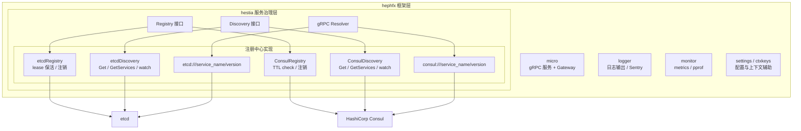
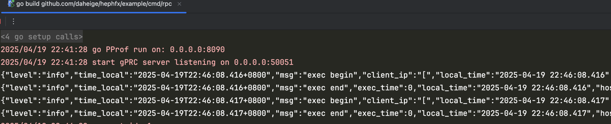
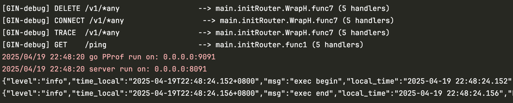

# Hephfx

A microservice framework for gRPC.

- 名字源自希腊神话中的 Hephaestus（赫菲斯托斯）‌，象征创造力、工艺与自动化‌，作为火神与锻造之神，其形象常与工具制造、工业效率相关联‌。
- 因此，采用这个名字的前面4个字母和fx组合后的名字`hephfx`代表特效`effects`或功能扩展`function extension`，表示工具的实用性与模块化能力‌。
- 该框架旨在帮助开发人员快速学习和上手gRPC微服务，降低微服务接入和学习成本，让开发人员能够更好地聚焦业务逻辑开发而设计。

# 目录

- [核心特性](#核心特性)
- [架构设计](#架构设计)
  - [运行模式](#运行模式)
- [主要目录](#主要目录)
- [环境准备](#环境准备)
- [快速开始](#快速开始)
  - [启动 gRPC 服务](#启动-grpc-服务)
  - [启动 gRPC HTTP Gateway 代理](#启动-grpc-http-gateway-代理)
- [组件库说明和使用](#组件库说明和使用)
  - [micro](#micro)
  - [hestia](#hestia)
  - [logger](#logger)
  - [monitor](#monitor)
  - [settings](#settings)
  - [ctxkeys / gutils](#ctxkeys--gutils)
- [rs-hestia（rust语言实现）](#rs-hestiarust语言实现)
  - [依赖引入](#依赖引入)
  - [最小可用示例](#最小可用示例)
  - [服务端注册](#服务端注册)
  - [客户端发现](#客户端发现)
  - [gRPC 客户端使用](#grpc-客户端使用)
  - [Options 常用配置](#options-常用配置)
  - [推荐项目结构](#推荐项目结构)
  - [consul实现服务发现和注册以及grpc resolver](#consul实现服务发现和注册以及grpc-resolver)
- [许可证](#许可证)

## 核心特性

- **gRPC 服务封装**：基于 `google.golang.org/grpc` 封装服务端启动流程，支持纯 gRPC、gRPC + HTTP Gateway 双端口、以及单端口共存三种启动模式。
- **HTTP Gateway 代理**：集成 `grpc-gateway/v2`，支持通过同一端口或独立端口暴露 RESTful API，并提供自定义路由、错误处理、Metadata 注入等扩展能力。
- **中间件生态**：内置 panic 恢复、请求日志、请求校验、Prometheus 监控等拦截器，同时支持自定义 unary/stream 拦截器。
- **服务注册与发现**：`hestia` 模块提供统一的 `Registry` / `Discovery` 抽象接口，支持按 `version` 进行服务注册与发现，内置负载均衡与 gRPC resolver。
- **多注册中心支持**：Go 与 Rust 均内置基于 etcd 的实现；Rust 版 `rs-hestia` 额外提供 HashiCorp Consul 实现，二者共享 `Service` 实体与接口语义，支持跨语言服务互通。
- **跨语言互通**：`Service` 字段与 JSON 格式在 Go 和 Rust 之间保持一致，Go 端注册的服务可被 Rust 客户端直接消费，反之亦然。
- **可观测性**：`monitor` 模块集成 Prometheus 指标与 Go pprof，提供 HTTP 接口 `/metrics` 与 `/debug/pprof`。
- **日志能力**：`logger` 模块基于 zap 封装，支持 JSON/文本输出、日志切割、文件/终端同时输出以及 Sentry 错误上报。
- **配置读取**：`settings` 模块基于 viper 抽象统一的配置读取接口，支持文件热加载。
- **工具方法**：`gutils` 提供 UUID、MD5、随机数、panic 堆栈捕获等常用工具函数；`ctxkeys` 提供上下文键名常量。

## 架构设计


```mermaid
graph TB
    subgraph hephfx["hephfx 框架层"]
        micro["micro<br/>gRPC 服务 + Gateway"]
        logger["logger<br/>日志输出 / Sentry"]
        monitor["monitor<br/>metrics / pprof"]
        settings["settings / ctxkeys<br/>配置与上下文辅助"]

        subgraph hestia["hestia 服务治理层"]
            registry["Registry 接口"]
            discovery["Discovery 接口"]
            resolver["gRPC Resolver"]

            subgraph hestiaImpl["注册中心实现"]
                etcdRegistry["etcdRegistry<br/>lease 保活 / 注销"]
                etcdDiscovery["etcdDiscovery<br/>Get / GetServices / watch"]
                etcdResolver["etcd:///service_name/version"]

                consulRegistry["ConsulRegistry<br/>TTL check / 注销"]
                consulDiscovery["ConsulDiscovery<br/>Get / GetServices / watch"]
                consulResolver["consul:///service_name/version"]
            end
        end
    end

    registry --> etcdRegistry
    registry --> consulRegistry
    discovery --> etcdDiscovery
    discovery --> consulDiscovery
    resolver --> etcdResolver
    resolver --> consulResolver

    etcdRegistry --> etcd["etcd"]
    etcdDiscovery --> etcd
    etcdResolver --> etcd

    consulRegistry --> consul["HashiCorp Consul"]
    consulDiscovery --> consul
    consulResolver --> consul
```

> 说明：Consul 实现目前位于 `rs-hestia`（Rust）中；Go 版 `hestia` 当前仅内置 etcd 实现，但二者共享同一套 `Registry` / `Discovery` 抽象语义。`Service` 实体字段与 JSON 格式保持一致，便于跨语言服务互通。

### 运行模式

`micro.NewService` 支持三种运行模式：

1. **纯 gRPC 服务**：仅监听 gRPC 端口。
2. **gRPC + HTTP Gateway 独立端口**：gRPC 与 HTTP Gateway 分别监听不同端口。
3. **gRPC 与 HTTP Gateway 共享端口**：基于 `h2c` 协议在同一端口上同时提供 gRPC 与 HTTP/REST 服务。

## 主要目录

```ini
./
├── LICENSE                       # MIT 开源协议
├── README.md / readme.md         # 项目说明
├── go.mod / go.sum               # Go 模块依赖
├── grpc-server.png               # gRPC 服务端运行截图
├── grpc-http-proxy.png           # HTTP Gateway 运行截图
├── example                       # gRPC 实战 demo
│   ├── bin                       # 工具脚本（protoc、校验生成等）
│   ├── clients                   # 多语言客户端示例
│   │   ├── go                    # Go 客户端示例
│   │   └── nodejs                # Node.js 客户端示例
│   ├── cmd                       # 可执行程序入口
│   │   ├── gateway               # HTTP Gateway 代理示例
│   │   └── rpc                   # gRPC 服务端示例
│   ├── internal                  # 业务内部实现
│   │   └── interfaces            # 接口层实现
│   ├── pb                        # protobuf 生成的 Go 代码
│   ├── protos                    # .proto 源文件
│   │   └── google                # google api proto 依赖
│   ├── readme.md                 # example 说明
│   └── tools                     # 工具脚本
│       └── validator_gen         # 校验码生成工具
├── ctxkeys                       # 上下文键名常量（request_id、client_ip 等）
├── gutils                        # 通用工具函数（UUID、MD5、随机数、堆栈捕获等）
├── hestia                        # 服务注册与发现抽象与 etcd 实现
│   ├── etcd                      # etcd 注册中心、发现、resolver 实现
│   │   ├── etcd.go               # etcd 客户端封装
│   │   ├── option.go             # etcd 配置选项
│   │   ├── registry.go           # etcd Registry 实现
│   │   ├── discovery.go          # etcd Discovery 实现
│   │   ├── resolver.go           # etcd gRPC Resolver 实现
│   │   ├── readme.md             # etcd 使用说明
│   │   └── *_test.go             # 单元/集成测试
│   ├── discovery.go              # Discovery 接口
│   ├── registry.go               # Registry 接口
│   ├── service_entity.go         # Service 实体定义
│   ├── netaddr.go                # 本机地址解析
│   └── *_test.go                 # 单元测试
├── rs-hestia                     # hestia 的 Rust 实现版本
│   ├── Cargo.toml / Cargo.lock   # Rust 包配置与依赖锁定
│   ├── readme.md                 # rs-hestia 使用说明
│   ├── src                       # 源码目录
│   │   ├── lib.rs                # crate 入口
│   │   ├── discovery.rs          # Discovery trait
│   │   ├── registry.rs           # Registry trait
│   │   ├── service.rs            # Service 实体与负载策略
│   │   ├── netaddr.rs            # 地址解析
│   │   ├── error.rs              # 错误定义
│   │   ├── etcd                  # etcd 注册、发现、resolver 实现
│   │   └── consul                # consul 注册、发现、resolver 实现
│   └── tests                     # 集成测试
│       ├── etcd_integration.rs   # etcd 集成测试
│       └── consul_integration.rs # consul 集成测试
├── logger                        # 基于 zap 的日志组件
│   └── example                   # logger 使用示例
│       └── sentry                # Sentry 上报示例
├── micro                         # gRPC 微服务封装
│   ├── micro.go                  # Service 核心实现
│   ├── option.go                 # 启动配置选项
│   ├── router.go                 # HTTP Gateway 自定义路由
│   ├── conn.go                   # gRPC 连接相关
│   ├── logger.go                 # 日志接口适配
│   ├── signals.go                # 信号处理
│   ├── readme.md                 # micro 使用说明
│   └── md_test.go / gutils.go    # 辅助与测试
├── monitor                       # 服务监控指标与 Go pprof
│   ├── gpprof                    # pprof HTTP 服务封装
│   ├── monitor.go                # HTTP 监控中间件
│   ├── prometheus.go             # Prometheus 初始化
│   └── monitor_test.go           # 测试
└── settings                      # 配置文件读取（基于 viper）
    ├── config.go                 # Config 接口
    ├── viper_config.go           # viper 实现
    ├── option.go                 # 配置选项
    ├── readme.md                 # settings 使用说明
    └── settings_test.go          # 测试
```

## 环境准备

1. 进入 https://go.dev/dl/ 官方网站，根据系统安装不同的go版本，这里推荐在linux或mac系统上面安装go。
2. 设置 GOPROXY

```shell
go env -w GOPROXY=https://goproxy.cn,direct
```

3. 安装 protoc 工具

- mac系统安装方式如下：

```shell
brew install protobuf
```

- linux系统安装方式如下：

```shell
# Reference: https://grpc.io/docs/protoc-installation/
PB_REL="https://github.com/protocolbuffers/protobuf/releases"
curl -LO $PB_REL/download/v3.15.8/protoc-3.15.8-linux-x86_64.zip
unzip -o protoc-3.15.8-linux-x86_64.zip -d $HOME/.local
export PATH=~/.local/bin:$PATH # Add this to your `~/.bashrc`.
protoc --version
libprotoc 3.15.8
```

4. 安装 gRPC 相关的 Go 工具链

```shell
# go gRPC tools
go install github.com/grpc-ecosystem/grpc-gateway/v2/protoc-gen-grpc-gateway@latest
go install github.com/grpc-ecosystem/grpc-gateway/v2/protoc-gen-openapiv2@latest
go install google.golang.org/protobuf/cmd/protoc-gen-go@latest
go install google.golang.org/grpc/cmd/protoc-gen-go-grpc@latest
go install github.com/daheige/validator_gen@latest

#This will place four binaries in your $GOBIN;
#    protoc-gen-grpc-gateway
#    protoc-gen-openapiv2
#    protoc-gen-go
#    protoc-gen-go-grpc

# google api link:https://github.com/googleapis/googleapis

# protoc inject tag
go install github.com/favadi/protoc-go-inject-tag@latest
```

## 快速开始

参考：[example](example) 或者 https://github.com/daheige/hephfx-micro-svc

### 启动 gRPC 服务

```go
package main

import (
    "context"
    "fmt"
    "log"
    "net/http"
    "time"

    "github.com/daheige/hephfx/example/pb"
    "github.com/daheige/hephfx/logger"
    "github.com/daheige/hephfx/micro"
    "github.com/daheige/hephfx/monitor"
)

func main() {
    logger.Default(
        logger.WithStdout(true),
        logger.WithJsonFormat(true),
    )

    s := micro.NewService(
        "0.0.0.0:50051",
        micro.WithEnableGRPCShareAddress(),
        micro.WithHandlerFromEndpoints(pb.RegisterGreeterHandlerFromEndpoint),
        micro.WithLogger(micro.LoggerFunc(log.Printf)),
        micro.WithShutdownTimeout(5*time.Second),
        micro.WithEnablePrometheus(),
        micro.WithEnableRequestValidator(),
        micro.WithRoutes(micro.Route{
            Method: "GET",
            Path:   "/healthz",
            Handler: func(w http.ResponseWriter, r *http.Request) {
                w.Write([]byte(`{"code":0,"message":"Ok"}`))
            },
        }),
    )

    // metrics: http://localhost:8090/metrics
    // pprof:  http://localhost:8090/debug/pprof
    monitor.InitMonitor(8090)

    pb.RegisterGreeterServer(s.GRPCServer, &GreeterServer{})
    if err := s.Run(); err != nil {
        log.Fatal(err)
    }
}

type GreeterServer struct {
    pb.UnimplementedGreeterServer
}

func (s *GreeterServer) SayHello(ctx context.Context, req *pb.HelloReq) (*pb.HelloReply, error) {
    return &pb.HelloReply{Message: fmt.Sprintf("hello,%s", req.Name)}, nil
}
```

服务端运行效果如下：



metrics and pprof

- metrics访问地址：http://localhost:8090/metrics
- pprof访问地址：http://localhost:8090/debug/pprof

### 启动 gRPC HTTP Gateway 代理

参考：[example/cmd/gateway](example/cmd/gateway)

运行效果如下：



metrics and pprof

- metrics访问地址：http://localhost:9091/metrics
- pprof访问地址：http://localhost:9091/debug/pprof

## 组件库说明和使用

### micro

`micro` 是框架的核心模块，负责 gRPC 服务的创建、启动、优雅停机以及 HTTP Gateway 的注册。

```go
s := micro.NewService(
    "0.0.0.0:50051",                                    // gRPC 监听地址
    micro.WithGRPCHTTPAddress("0.0.0.0:8080"),          // HTTP Gateway 独立端口
    // micro.WithEnableGRPCShareAddress(),                // 与 gRPC 共享端口
    micro.WithHandlerFromEndpoints(pb.RegisterGreeterHandlerFromEndpoint),
    micro.WithEnableRequestAccess(),                      // 开启请求日志
    micro.WithEnablePrometheus(),                         // 开启 Prometheus 拦截器
    micro.WithEnableRequestValidator(),                   // 开启请求校验
    micro.WithShutdownTimeout(5*time.Second),
)
```
micro实战参考：
- https://github.com/daheige/hephfx-micro-svc
- https://github.com/daheige/hephfx/tree/main/example

常用配置项见 [micro/option.go](micro/option.go)。micro更多用法查看：https://github.com/daheige/hephfx/tree/main/micro

### hestia

`hestia` 提供服务注册与发现能力，内置基于 etcd 的实现；Rust 版 `rs-hestia` 在此基础上额外提供 HashiCorp Consul 实现。两套实现共享 `Registry` / `Discovery` 抽象与 `Service` 实体定义，支持 `etcd:///service/version` 与 `consul:///service/version` 两种 gRPC resolver target，Go 与 Rust 服务可互相注册和发现。

- 服务端注册

```go
registry, _ := etcd.NewRegistry([]string{"http://127.0.0.1:12379"})
registry.Register(ctx, &hestia.Service{
    Network: "tcp",
    Name:    "my-service",
    Address: ":8080",
    Version: "v1",
})
```

- 客户端发现

```go
discovery, _ := etcd.NewDiscovery([]string{"http://127.0.0.1:12379"})
svc, _ := discovery.Get(ctx, "my-service", "v1")
```

- gRPC resolver

```go
etcd.RegisterEtcdResolver(discovery)
conn, _ := grpc.NewClient(
    "etcd:///my-service/v1",
    grpc.WithDefaultServiceConfig(`{"loadBalancingConfig": [{"round_robin":{}}]}`),
    grpc.WithTransportCredentials(insecure.NewCredentials()),
)
```

更多用法参考 [hestia/readme.md](hestia/readme.md)。

### logger

基于 zap 的日志组件，支持 JSON 格式化、文件输出、日志切割和 Sentry 错误上报。

```go
logger.Default(
    logger.WithJsonFormat(true),
    logger.WithLogLevel(zap.InfoLevel),
    logger.WithStdout(true),
    logger.WithEnableSentry(true),
    logger.WithSentryLevel(zap.ErrorLevel),
)

logger.Info(ctx, "hello", "key", "value")
logger.Error(ctx, "something wrong", "err", err)
```

更多用法参考 [logger/readme.md](logger/readme.md)。

### monitor

集成 Prometheus 指标与 Go pprof，内置 HTTP 请求总量与耗时统计。

```go
// 端口 8090：http://localhost:8090/metrics
// 端口 8090：http://localhost:8090/debug/pprof
monitor.InitMonitor(8090)

// Web 服务可额外注册 web_request_total/web_request_duration_seconds
monitor.InitMonitor(9091, true)
```

### settings

基于 viper 的配置读取模块，支持 YAML 等格式以及文件变更监听。

```go
cfg, err := settings.Load("./app.yaml")
if err != nil {
    log.Fatal(err)
}

cfg.ReadSection("server", &serverConfig)
```

### ctxkeys / gutils

- `ctxkeys`：定义上下文键常量，避免 key 冲突。
- `gutils`：提供 `Uuid()`、`Md5()`、`RandInt64()`、`CatchStack()` 等工具函数。

```go
requestID := ctxkeys.XRequestID.String()
uuid := gutils.Uuid()
stack := gutils.CatchStack()
```
## rs-hestia（rust语言实现）

`rs-hestia` 已发布到 crates.io，版本号跟随 `Cargo.toml` 定义（当前 `0.1.2`）。在 Rust 项目中使用时，只需在 `Cargo.toml` 中添加依赖，即可通过 `Registry` 注册服务、`Discovery` 发现服务、`EtcdResolver` 构建 tonic gRPC 通道。

### 依赖引入

```toml
[dependencies]
rs-hestia = "0.1.2"
tokio = { version = "1", features = ["full"] }
```

如果使用 git 依赖：

```toml
# git 依赖
rs-hestia = { git = "https://github.com/daheige/hephfx.git", branch = "main" }
```

### 最小可用示例

下面是一个同时包含服务端注册和客户端发现的完整最小示例，假设本地已经通过 Docker 启动了 etcd（监听 `127.0.0.1:12379`）。

```rust
use rs_hestia::etcd::{Options, new_registry, new_discovery};
use rs_hestia::{Context, Service, ProtocolType};

#[tokio::main]
async fn main() -> rs_hestia::Result<()> {
    let ctx = Context::new();

    // 1. 创建注册中心
    let registry = new_registry(Options::new(vec![
        "http://127.0.0.1:12379".to_string(),
    ])).await?;

    // 2. 创建发现中心
    let discovery = new_discovery(Options::new(vec![
        "http://127.0.0.1:12379".to_string(),
    ])).await?;

    // 3. 构造并注册服务
    let mut svc = Service {
        network: "tcp".to_string(),
        name: "hello-service".to_string(),
        address: ":8080".to_string(), // 空 host 自动解析为本机 IPv4
        version: "v1".to_string(),
        weight: 100,
        protocol: ProtocolType::Http,
        ..Default::default()
    };
    registry.register(&ctx, &mut svc).await?;
    println!("registered: {}", svc.instance_id);

    // 4. 发现服务
    let list = discovery.get_services(&ctx, "hello-service", "v1").await?;
    println!("discovered: {:?}", list);

    // 5. 负载均衡选取一个实例
    let selected = discovery.get(&ctx, "hello-service", "v1", None).await?;
    println!("selected: {}://{}", selected.network, selected.address);

    // 6. 应用退出时注销
    registry.deregister(&ctx, &mut svc).await?;
    Ok(())
}
```

### 服务端注册

服务端通常需要在启动时注册自身，并在进程退出前注销。注册成功后，`rs-hestia` 会自动维护 etcd lease keepalive，默认 TTL 为 60 秒。

```rust
use rs_hestia::etcd::{Options, new_registry};
use rs_hestia::{Context, Service, ProtocolType};

#[tokio::main]
async fn main() -> rs_hestia::Result<()> {
    let ctx = Context::new();

    let registry = new_registry(
        Options::new(vec!["http://127.0.0.1:12379".to_string()])
            .with_lease_ttl(60),
    ).await?;

    let mut svc = Service {
        network: "tcp".to_string(),
        name: "order-service".to_string(),
        address: ":8080".to_string(),
        version: "v1".to_string(),
        weight: 100,
        protocol: ProtocolType::Grpc,
        ..Default::default()
    };

    registry.register(&ctx, &mut svc).await?;
    println!("registered instance_id: {}", svc.instance_id);

    // 保持运行，直到收到退出信号
    tokio::signal::ctrl_c().await.ok();

    registry.deregister(&ctx, &mut svc).await?;
    Ok(())
}
```

### 客户端发现

客户端通过 `Discovery` 获取服务列表或单个实例。`get` 方法默认使用内置轮询策略；传入 `Some(strategy)` 可覆盖。

```rust
use rs_hestia::etcd::{Options, new_discovery};
use rs_hestia::{Context, Service};

#[tokio::main]
async fn main() -> rs_hestia::Result<()> {
    let ctx = Context::new();

    let discovery = new_discovery(
        Options::new(vec!["http://127.0.0.1:12379".to_string()])
            .with_enable_watched(), // 开启 watch 实时刷新本地缓存
    ).await?;

    // 获取全部健康实例
    let services = discovery.get_services(&ctx, "order-service", "v1").await?;
    println!("services: {:?}", services);

    // 使用内置轮询策略
    let svc = discovery.get(&ctx, "order-service", "v1", None).await?;
    println!("round-robin: {}://{}", svc.network, svc.address);

    // 自定义策略：总是返回第一个实例
    let svc = discovery.get(
        &ctx,
        "order-service",
        "v1",
        Some(std::sync::Arc::new(|list: &[Service]| list.first().cloned())),
    ).await?;

    Ok(())
}
```

### gRPC 客户端使用

`rs-hestia` 提供了 tonic gRPC resolver。客户端可以通过 `etcd:///service/version` 形式的 target 直接构建 `Channel`。resolver 只会选取 `protocol` 为 `Grpc` 的实例，其他协议会被过滤。

```rust
use rs_hestia::etcd::{Options, new_discovery, build_channel};
use rs_hestia::Context;

#[tokio::main]
async fn main() -> rs_hestia::Result<()> {
    let _ctx = Context::new();

    let discovery = new_discovery(Options::new(vec![
        "http://127.0.0.1:12379".to_string(),
    ])).await?;

    // target 格式：etcd:///service_name/version
    let channel = build_channel("etcd:///order-service/v1", discovery).await?;

    // 用 channel 创建具体的 tonic gRPC client
    // let client = order::OrderServiceClient::new(channel);

    Ok(())
}
```

### Options 常用配置

`Options` 同时用于 `new_registry` 和 `new_discovery`，所有配置项均可链式调用：

| 方法 | 默认值 | 说明 |
|------|--------|------|
| `with_endpoints` | `vec!["http://127.0.0.1:2379"]` | etcd 节点地址列表 |
| `with_dial_timeout` | 5 秒 | 连接 etcd 超时时间 |
| `with_lease_ttl` | 60 秒 | 注册租约 TTL |
| `with_prefix` | `/hestia/registry-etcd` | etcd key 前缀 |
| `with_username` / `with_password` | 空 | etcd 认证信息 |
| `with_validate_address` | `false` | 注册时是否校验 address 格式 |
| `with_enable_watched` | 关闭 | 开启 watch 实时刷新本地缓存 |

```rust
use std::time::Duration;
use rs_hestia::etcd::{Options, new_registry};

let registry = new_registry(
    Options::new(vec!["http://127.0.0.1:12379".to_string()])
        .with_dial_timeout(Duration::from_secs(10))
        .with_lease_ttl(60)
        .with_prefix("/myapp/registry")
        .with_username("root")
        .with_password("root")
        .with_validate_address(true),
).await?;
```

### 推荐项目结构

在一个同时包含 gRPC server 和 client 的 Rust 项目中，可以按如下方式组织：

```text
myapp/
├── Cargo.toml
├── proto/              # .proto 文件
├── src/
│   ├── main.rs         # server 入口：初始化 registry 并注册服务
│   ├── client.rs       # client 入口：通过 discovery/resolver 调用服务
│   └── pb.rs           # tonic 生成的代码
```

服务端入口负责 `new_registry` + `register` + `keepalive`，客户端入口负责 `new_discovery` + `build_channel` 或 `get`，二者共享同一个 etcd 集群即可实现跨语言服务注册与发现。

### consul实现服务发现和注册以及grpc resolver

除 etcd 外，`rs-hestia` 还提供基于 HashiCorp Consul 的实现，接口与 etcd 完全一致。

#### 依赖引入

Consul 实现通过 `reqwest` 调用 Consul HTTP API，已包含在 `rs-hestia` 依赖中，无需额外引入。

#### 启动 Consul

```bash
docker run -d --name consul \
  -p 8500:8500 \
  hashicorp/consul consul agent -dev -ui -client=0.0.0.0
```

#### 服务端注册

```rust
use rs_hestia::consul::{Options, new_registry};
use rs_hestia::{Context, Service, ProtocolType};

#[tokio::main]
async fn main() -> rs_hestia::Result<()> {
    let ctx = Context::new();

    let registry = new_registry(
        Options::new(vec!["http://127.0.0.1:8500".to_string()])
            .with_health_check_ttl(10),
    ).await?;

    let mut svc = Service {
        network: "tcp".to_string(),
        name: "order-service".to_string(),
        address: ":8080".to_string(),
        version: "v1".to_string(),
        weight: 100,
        protocol: ProtocolType::Grpc,
        ..Default::default()
    };

    registry.register(&ctx, &mut svc).await?;
    println!("registered instance_id: {}", svc.instance_id);

    tokio::signal::ctrl_c().await.ok();

    registry.deregister(&ctx, &mut svc).await?;
    Ok(())
}
```

#### 客户端发现

```rust
use rs_hestia::consul::{Options, new_discovery};
use rs_hestia::Context;

#[tokio::main]
async fn main() -> rs_hestia::Result<()> {
    let ctx = Context::new();

    let discovery = new_discovery(
        Options::new(vec!["http://127.0.0.1:8500".to_string()])
            .with_enable_watch(),
    ).await?;

    let services = discovery.get_services(&ctx, "order-service", "v1").await?;
    println!("services: {:?}", services);

    let svc = discovery.get(&ctx, "order-service", "v1", None).await?;
    println!("selected: {}://{}", svc.network, svc.address);

    Ok(())
}
```

#### gRPC 客户端使用

```rust
use rs_hestia::consul::{Options, new_discovery, build_channel};
use rs_hestia::Context;

#[tokio::main]
async fn main() -> rs_hestia::Result<()> {
    let _ctx = Context::new();

    let discovery = new_discovery(
        Options::new(vec!["http://127.0.0.1:8500".to_string()]),
    ).await?;

    let channel = build_channel("consul:///order-service/v1", discovery).await?;
    // let client = order::OrderServiceClient::new(channel);

    Ok(())
}
```

#### target 格式说明

- `consul:///order_service/v1`：服务名 `order_service`，版本 `v1`。
- `consul:///order_service`：服务名 `order_service`，版本为空。
- resolver 仅选取 `protocol` 为 `Grpc` 的实例，其他协议会被过滤。
- 若传入的 discovery 是 `ConsulDiscovery`，resolver 会复用其 blocking-query watch 能力；否则退化为 10 秒轮询。

#### 更多文档

Consul 模块的详细说明（核心特性、架构设计、部署方式、单元测试、注意事项、许可证等）请参考 [rs-hestia/src/consul/readme.md](rs-hestia/src/consul/readme.md)。

## 许可证

本项目采用 [MIT License](LICENSE) 开源协议。

Copyright (c) 2025 heige
