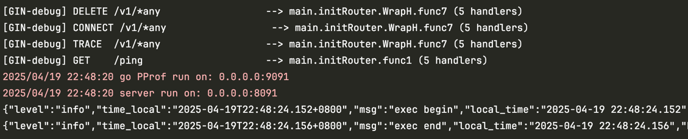

# Hephfx
A microservice framework for gRPC
- 名字源自希腊神话中的 Hephaestus（赫菲斯托斯）‌，象征创造力、工艺与自动化‌，作为火神与锻造之神，其形象常与工具制造、工业效率相关联‌。
- 因此，采用这个名字的前面4个字母和fx组合后的名字`hephfx`代表特效`effects`或功能扩展`function extension`，表示工具的实用性与模块化能力‌。
- 该框架旨在帮助开发人员快速学习和上手gRPC微服务，降低微服务接入和学习成本，让开发人员能够更好地聚焦业务逻辑开发而设计。

目前框架现有的组件：
```ini
./
├── LICENSE
├── README.md
├── example     # gRPC实战demo
├── go.mod
├── go.sum
├── logger      # 日志组件
├── micro       # gRPC微服务封装，支持3种不同情况的gRPC 和 http gateway启动
├── monitor     # 服务监控metrics和Go pprof
├── hestia      # 服务发现和注册，基于etcd实现
└── settings    # 配置文件读取
```

# Tool installation before development
1. 进入 https://go.dev/dl/ 官方网站，根据系统安装不同的go版本，这里推荐在linux或mac系统上面安装go。
2. 设置GOPROXY
```shell
go env -w GOPROXY=https://goproxy.cn,direct
```
3. 安装protoc工具
- mac系统安装方式如下：
```shell
brew install protobuf
```
- linux系统安装方式如下：
```shell
# Reference: https://grpc.io/docs/protoc-installation/
PB_REL="https://github.com/protocolbuffers/protobuf/releases"
curl -LO $PB_REL/download/v3.15.8/protoc-3.15.8-linux-x86_64.zip
unzip -o protoc-3.15.8-linux-x86_64.zip -d $HOME/.local
export PATH=~/.local/bin:$PATH # Add this to your `~/.bashrc`.
protoc --version
libprotoc 3.15.8
```
4. 安装grpc相关的go工具链
```shell
# go gRPC tools
go install github.com/grpc-ecosystem/grpc-gateway/v2/protoc-gen-grpc-gateway@latest
go install github.com/grpc-ecosystem/grpc-gateway/v2/protoc-gen-openapiv2@latest
# Reference: https://grpc.io/docs/languages/go/quickstart/
go install google.golang.org/protobuf/cmd/protoc-gen-go@latest
go install google.golang.org/grpc/cmd/protoc-gen-go-grpc@latest
```

# Quick Start
参考：[example](example)
服务端运行效果如下：


metrics and pprof
- metrics访问地址：http://localhost:8090/metrics
- pprof访问地址：http://localhost:8090/debug/pprof

# gRPC HTTP Proxy (gateway)
参考:[example/cmd/gateway](example/cmd/gateway)
运行效果如下：


metrics and pprof
- metrics访问地址：http://localhost:9091/metrics
- pprof访问地址：http://localhost:9091/debug/pprof
