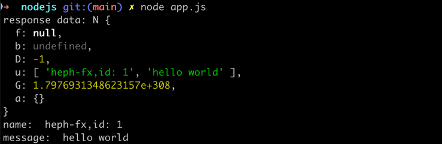

# example
    hephfx/micro实战
# gen code for Go
执行如下命令实现go代码生成
```shell
sh bin/go-generate.sh
```
一般来说，生成的pb代码，建议放在独立git仓库中，方便集中式管理和维护。

# start running
1. 先运行命令`go run cmd/rpc/main.go`启动服务端。
2. 接着执行`go run clients/go/main.go`运行客户端。

# grpc gateway
1. 需要在proto文件添加如下核心配置
```protobuf
import "google/api/annotations.proto";

// Greeter service 定义开放调用的服务
service Greeter {
    rpc SayHello (HelloReq) returns (HelloReply){
        option (google.api.http) = {
            get: "/v1/say/{id}"
        };
    };
}
```
2. 执行`go run cmd/gateway/main.go`即可（启动之前，需要先启动rpc服务端）。

# grpc grpcurl tools
- grpcurl工具主要用于grpcurl请求，可以快速查看grpc proto定义以及调用grpc service定义的方法。
- grpcurl参考地址：https://github.com/fullstorydev/grpcurl

1. 安装grpcurl工具
```shell
brew install grpcurl
```
如果你本地安装了golang，那可以直接运行如下命令，安装grpcurl工具
```shell
go install github.com/fullstorydev/grpcurl/cmd/grpcurl@latest
```
2. 验证grpc service启动的效果
```shell
# 50051 是grpc微服务的端口
grpcurl -plaintext 127.0.0.1:50051 list
```

执行上面的命令，输出结果如下：
```ini
Hello.Greeter
grpc.reflection.v1.ServerReflection
grpc.reflection.v1alpha.ServerReflection
```
3. 查看proto文件定义的所有方法
```shell
grpcurl -plaintext 127.0.0.1:50051 describe Hello.Greeter
```
输出结果如下：
```ini
Hello.Greeter is a service:
service Greeter {
  rpc SayHello ( .Hello.HelloReq ) returns ( .Hello.HelloReply ) {
    option (.google.api.http) = { get: "/v1/say/{name}" };
  }
}
```
4. 查看请求参数定义
```shell
grpcurl -plaintext 127.0.0.1:50051 describe Hello.HelloReq
```
输出结果如下：
```ini
Hello.HelloReq is a message:
message HelloReq {
  string name = 1;
}
```
5. 请求grpc方法
```shell
grpcurl -d '{"name":"daheige"}' -plaintext 127.0.0.1:50051 Hello.Greeter.SayHello
```
返回结果如下：
```json
{
  "message": "hello,daheige"
}
```

# gen and run nodejs code
1. install grpc tools
```shell
sh bin/node-grpc-tools.sh
```

2. gen nodejs code
```shell
sh bin/nodejs-gen.sh
```

输出结果如下：
```ini
Generating codes...

generating nodejs stubs...
generating nodejs code success

Generate codes successfully!
```

3. install nodejs package
```shell
cd clients/nodejs && npm install
```

4. run node client
```shell
node clients/nodejs/app.js
```


# only start grpc server
```go
grpcPort := 50051
// 创建grpc微服务实例
s := micro.NewService(
    fmt.Sprintf("0.0.0.0:%d", grpcPort),
    
    micro.WithLogger(micro.LoggerFunc(log.Printf)),
    micro.WithShutdownTimeout(5*time.Second),
    micro.WithEnablePrometheus(), // prometheus interceptor

    micro.WithEnableRequestValidator(), // request validator interceptor
    // 使用自定义请求拦截器
    micro.WithUnaryInterceptor(interceptor.AccessLog),
    micro.WithShutdownFunc(func() {
        time.Sleep(3 * time.Second) // mock long operations
        log.Println("grpc server shutdown")
    }),
)
```

# start grpc and http gateway use one port
```go
// ...
grpcPort := 50051
// 创建grpc微服务实例
s := micro.NewService(
    fmt.Sprintf("0.0.0.0:%d", grpcPort),
    
    // start grpc and http gateway use one address
    micro.WithEnableGRPCShareAddress(),
    micro.WithHandlerFromEndpoints(pb.RegisterGreeterHandlerFromEndpoint), // register http endpoint
    
    micro.WithLogger(micro.LoggerFunc(log.Printf)),
    micro.WithShutdownTimeout(5*time.Second),
    micro.WithEnablePrometheus(), // prometheus interceptor
    
    micro.WithEnableRequestValidator(), // request validator interceptor
	
    // 使用自定义请求拦截器
    micro.WithUnaryInterceptor(interceptor.AccessLog),
    micro.WithShutdownFunc(func() {
    time.Sleep(3 * time.Second) // mock long operations
    log.Println("grpc server shutdown")
    }),
)
// ...
```
请求接口如下：
```shell
curl 'http://localhost:50051/v1/say/daheige'
```
运行结果如下：
```json
{"message":"hello,daheige"}
```

# start grpc and http gateway use different address
```go
// ...
grpcPort := 50051
// 创建grpc微服务实例
s := micro.NewService(
    fmt.Sprintf("0.0.0.0:%d", grpcPort),

    micro.WithGRPCHTTPAddress(fmt.Sprintf("0.0.0.0:%d", 8080)),
    micro.WithHandlerFromEndpoints(pb.RegisterGreeterHandlerFromEndpoint), // register http endpoint
    
    micro.WithLogger(micro.LoggerFunc(log.Printf)),
    micro.WithShutdownTimeout(5*time.Second),
    micro.WithEnablePrometheus(), // prometheus interceptor
    
    micro.WithEnableRequestValidator(), // request validator interceptor
	
    // 使用自定义请求拦截器
    micro.WithUnaryInterceptor(interceptor.AccessLog),
    micro.WithShutdownFunc(func() {
    time.Sleep(3 * time.Second) // mock long operations
    log.Println("grpc server shutdown")
    }),
)
// ...
```
