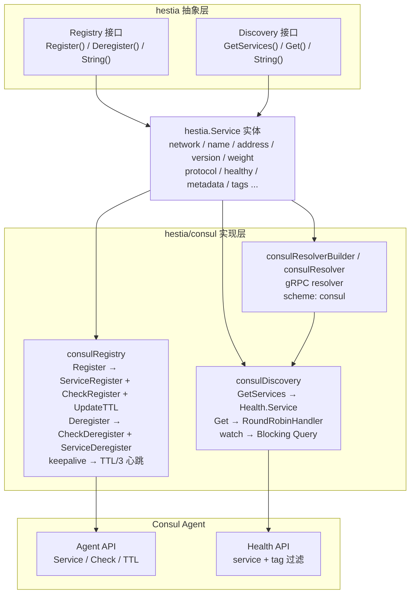
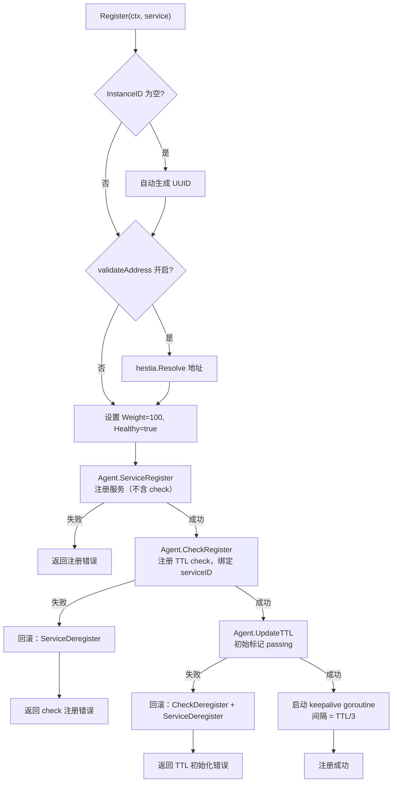
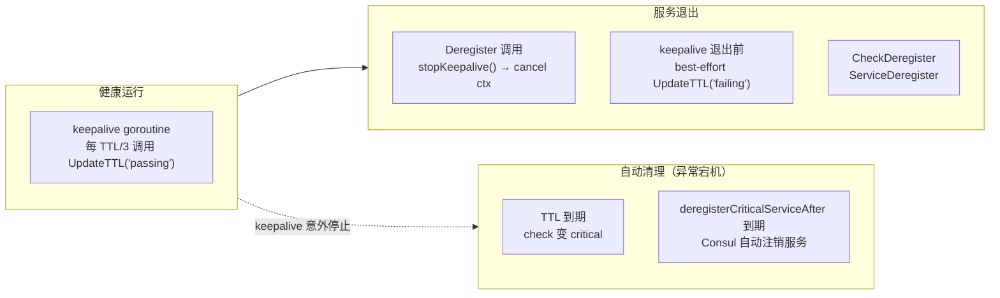
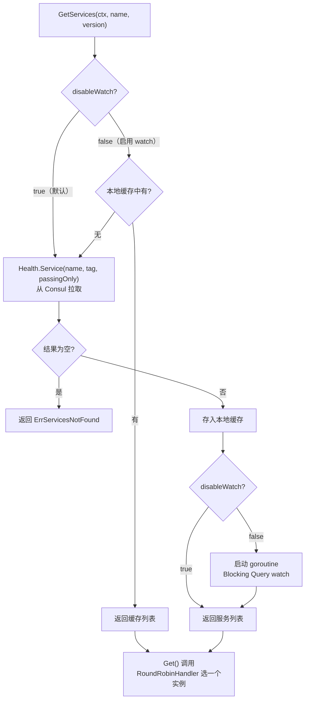
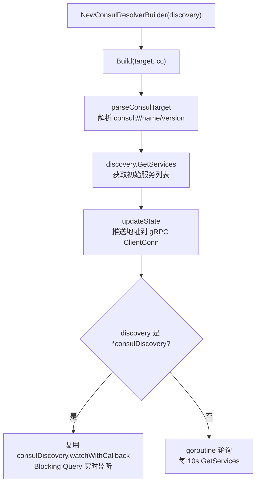

# hestia/consul

`hestia/consul` 是基于 HashiCorp Consul 的服务注册与服务发现模块，实现了 `hestia.Registry` 和 `hestia.Discovery` 接口，并提供 gRPC resolver 支持。

## 目录

- [核心特性](#核心特性)
- [架构设计](#架构设计)
- [快速开始](#快速开始)
- [服务端服务注册](#服务端服务注册)
- [客户端服务发现和调用](#客户端服务发现和调用)
- [gRPC 服务发现](#grpc-服务发现)
- [Kubernetes 部署建议](#kubernetes-部署建议)
- [注意事项](#注意事项)
- [许可证](#许可证)

## 核心特性

- **接口化设计**：实现 `hestia.Registry` 和 `hestia.Discovery` 接口，与 etcd 实现无缝切换。
- **TTL 健康检查**：基于 Consul Agent 的 TTL check 机制，服务注册与 check 分离注册；注册后以 TTL/3 间隔定期心跳保活，服务退出后停止心跳，TTL 到期自动标记 critical 并最终注销。
- **故障回滚**：注册过程中若 check 注册或初始 TTL pass 失败，自动回滚已注册的 service 和 check，避免残留脏数据。
- **Blocking Query Watch**：通过 Consul 原生 long polling（blocking query）实现服务列表变更的实时监听，相比 etcd watch 更节省连接资源。
- **版本隔离**：版本号以 `hestia-version=v1` 格式存储为 Consul tag，发现时通过 Health API 的 tag 参数精准过滤。
- **元数据映射**：`hestia.Service` 的非基础字段存储在 Consul `Meta` 中，以 `tag_` 和 `meta_` 前缀区分用户自定义 tags 与 metadata。
- **地址自动解析**：`hestia.Resolve` 可自动将 `:port` 或 `::` 解析为本机 IPv4 地址。
- **负载均衡策略**：内置轮询策略 `hestia.RoundRobinHandler`，发现端支持传入自定义 `StrategyHandler`。
- **ACL 支持**：通过 `WithToken` 配置 Consul ACL token。
- **gRPC Resolver**：提供基于 Consul 的 gRPC resolver，客户端可通过 `consul:///service/version` 直接访问服务。

## 架构设计



### 数据映射

`hestia.Service` 注册到 Consul 时，字段映射如下：

| hestia.Service 字段 | Consul 对应字段 | 说明 |
|---|---|---|
| `InstanceID` | `AgentServiceRegistration.ID` 和 `Meta["hestia-instance-id"]` | 服务唯一标识 |
| `Name` | `AgentServiceRegistration.Name` | Consul 服务名 |
| `Address` (host) | `AgentServiceRegistration.Address` | 主机地址 |
| `Address` (port) | `AgentServiceRegistration.Port` | 端口号 |
| `Version` | `Tags` 中 `hestia-version=v1` 和 `Meta["version"]` | 版本号，双重存储便于过滤与回显 |
| `Weight` | `Meta["weight"]` | 权重，默认 100 |
| `Protocol` | `Meta["protocol"]` | 协议类型（GRPC / HTTP） |
| `Network` | `Meta["network"]` | 网络类型，默认 tcp |
| `NamingAddress` | `Meta["naming_address"]` | K8s 命名服务地址 |
| `Tags` | `Meta["tag_xxx"]` | 用户自定义 tags |
| `Metadata` | `Meta["meta_xxx"]` | 用户自定义 metadata |

### 注册流程



### 心跳与注销生命周期



### 服务发现流程



### 核心接口

```go
// Registry 服务注册接口
type Registry interface {
    Register(ctx context.Context, s *Service) error
    Deregister(ctx context.Context, s *Service) error
    String() string
}

// Discovery 服务发现接口
type Discovery interface {
    GetServices(ctx context.Context, name string, version string) ([]*Service, error)
    Get(ctx context.Context, name string, version string, strategyHandler ...StrategyHandler) (*Service, error)
    String() string
}
```

## 快速开始

### 环境要求

- Go >= 1.26.0
- Consul >= 1.x

### 启动 Consul

本地开发可使用 Docker 快速启动一个 Consul agent：

```bash
docker run -d --name consul \
  -p 8500:8500 \
  hashicorp/consul:latest
```

### 安装依赖

```bash
go get github.com/daheige/hephfx/hestia/consul
```

## 服务端服务注册

```go
package main

import (
    "context"
    "log"
    "time"

    "github.com/daheige/hephfx/hestia"
    "github.com/daheige/hephfx/hestia/consul"
)

func main() {
    ctx := context.Background()

    // 创建注册中心实例
    registry, err := consul.NewRegistry([]string{
        "127.0.0.1:8500",
    })
    if err != nil {
        log.Fatalf("create registry error: %v", err)
    }

    // 构造服务信息
    svc := &hestia.Service{
        Network:  "tcp",
        Name:     "my-service",
        Address:  ":8080", // 空 host 会自动解析为本机 IPv4
        Version:  "v1",
        Weight:   100,                          // 权重，默认 100，0 表示不参与负载均衡
        Protocol: hestia.ProtocolHTTP,          // 协议类型：GRPC / HTTP
        Created:  time.Now().Format("2006-01-02 15:04:05"),
        Metadata: map[string]interface{}{
            "region": "cn-north-1",
        },
        Tags: map[string]string{
            "env": "prod",
        },
    }

    // 注册服务，注册成功后 svc.InstanceID 会被自动填充
    if err := registry.Register(ctx, svc); err != nil {
        log.Fatalf("register service error: %v", err)
    }

    log.Printf("service registered, instance_id: %s", svc.InstanceID)

    // 保持运行，退出时注销
    select {}

    // 应用退出时注销服务
    _ = registry.Deregister(ctx, svc)
}
```

### 注册可选项

```go
registry, err := consul.NewRegistry(
    []string{"127.0.0.1:8500"},
    consul.WithDialTimeout(10*time.Second),        // 连接超时
    consul.WithTTL("30s"),                          // TTL 健康检查间隔
    consul.WithDeregisterCriticalServiceAfter("90s"), // critical 后自动注销时间
    consul.WithPrefix("hestia"),                    // 服务名前缀
    consul.WithToken("your-acl-token"),             // ACL token
    consul.WithValidateAddress(true),               // 注册时校验地址有效性
)
```

## 客户端服务发现和调用

```go
package main

import (
    "context"
    "log"

    "github.com/daheige/hephfx/hestia"
    "github.com/daheige/hephfx/hestia/consul"
)

func main() {
    ctx := context.Background()

    discovery, err := consul.NewDiscovery([]string{
        "127.0.0.1:8500",
    })
    if err != nil {
        log.Fatalf("create discovery error: %v", err)
    }

    // 获取全部服务实例（仅返回 Healthy=true 的实例）
    services, err := discovery.GetServices(ctx, "my-service", "v1")
    if err != nil {
        log.Fatalf("get services error: %v", err)
    }
    log.Printf("services count: %d", len(services))

    // 使用内置轮询策略获取一个可用实例
    svc, err := discovery.Get(ctx, "my-service", "v1")
    if err != nil {
        log.Fatalf("get service error: %v", err)
    }
    log.Printf("selected service: %s://%s", svc.Network, svc.Address)

    // 也可以传入自定义策略
    svc, err = discovery.Get(ctx, "my-service", "v1", func(list []*hestia.Service) *hestia.Service {
        if len(list) == 0 {
            return nil
        }
        return list[0]
    })
    if err != nil {
        log.Fatalf("get service error: %v", err)
    }
}
```

### 启用 watch 监听

默认情况下，`GetServices` 每次都会从 Consul 拉取最新数据。如需启用本地缓存并通过 blocking query 实时刷新，可配置：

```go
discovery, err := consul.NewDiscovery(
    []string{"127.0.0.1:8500"},
    consul.WithEnableWatched(),
)
```

启用后，首次获取某服务列表时会启动 goroutine 通过 blocking query（`WaitTime=5min`）持续监听变更，并在本地缓存中更新服务列表。blocking query 相比轮询更节省连接资源：请求长时间挂起，仅在服务列表有变化或超时时返回。

## gRPC 服务发现

`hestia/consul` 提供了 gRPC resolver，支持通过 `consul:///service_name/version` 形式的 target 进行服务发现。

### 架构说明

gRPC resolver 构建在 `hestia.Discovery` 接口之上，不直接依赖 Consul API：

- 当传入的 discovery 是 `*consulDiscovery` 时，resolver 直接复用其内部的 `watchWithCallback` 方法，通过 Consul blocking query 实时感知服务变更
- 当传入其他 discovery 实现时，退化为 10 秒轮询模式



### 全局注册 resolver

```go
package main

import (
    "log"

    "google.golang.org/grpc"
    "google.golang.org/grpc/credentials/insecure"

    "github.com/daheige/hephfx/hestia/consul"
)

func main() {
    discovery, err := consul.NewDiscovery([]string{
        "127.0.0.1:8500",
    })
    if err != nil {
        log.Fatal(err)
    }

    // scheme 固定为 "consul"，全局注册
    consul.RegisterConsulResolver(discovery)

    conn, err := grpc.NewClient(
        "consul:///order_service/v1",
        grpc.WithDefaultServiceConfig(`{"loadBalancingConfig": [{"round_robin":{}}]}`),
        grpc.WithTransportCredentials(insecure.NewCredentials()),
    )
    if err != nil {
        log.Fatal(err)
    }
    defer conn.Close()

    // 使用 conn 创建 gRPC client 并发起调用...
    _ = conn
}
```

### 显式注入 resolver.Builder

```go
builder := consul.NewConsulResolverBuilder(discovery)
resolver.Register(builder)
```

### target 格式说明

- `consul:///order_service/v1`：服务名 `order_service`，版本 `v1`
- `consul:///order_service`：服务名 `order_service`，版本为空
- resolver 仅将 `Protocol` 为空或 `hestia.ProtocolGRPC` 的实例纳入 gRPC 地址列表，HTTP 服务会被自动过滤
- 服务暂时不存在时，resolver 不会直接失败，而是返回空地址列表并持续监听；待服务注册后会自动更新地址列表
- `ResolveNow` 当前为空实现，状态更新完全由 watch/poll goroutine 驱动

### 配合 gRPC 负载均衡

```go
conn, err := grpc.NewClient(
    "consul:///order_service/v1",
    // 启用客户端轮询负载均衡
    grpc.WithDefaultServiceConfig(`{"loadBalancingConfig": [{"round_robin":{}}]}`),
    grpc.WithTransportCredentials(insecure.NewCredentials()),
)
```

gRPC 的 `round_robin` 策略会在 resolver 推送的多个地址之间做客户端侧负载均衡，与 Consul 服务端的健康检查配合，自动剔除不健康的实例。

## Kubernetes 部署建议

### Consul agent 部署模式

K8s 环境中推荐使用 Consul 的 **client agent** 模式，在每个 Node 上以 DaemonSet 运行一个 Consul agent。Pod 内的应用通过 `localhost:8500` 或 Node 的 `hostIP:8500` 连接 Consul agent：

```go
registry, err := consul.NewRegistry([]string{
    "localhost:8500", // 同节点的 Consul agent
})
```

### Pod IP 注入

在 K8s 中注册服务时，最可靠的方式是通过 **Downward API 注入 Pod IP**，而不是依赖 `hestia.Resolve(":port")` 自动推导本机 IP。

**为什么不建议依赖自动推导**：`hestia.Resolve` 在 host 为空时会调用 `localIPv4Host()` 取第一个非 loopback 的 IPv4。在 K8s Pod 里，若存在多网卡、sidecar（如 Istio）或特殊 CNI 配置，取到的地址可能不是预期的 Pod IP。

在 Deployment/StatefulSet 中注入 Pod IP：

```yaml
env:
  - name: POD_IP
    valueFrom:
      fieldRef:
        fieldPath: status.podIP
```

IP 地址获取方式如下：

```go
podIP := os.Getenv("POD_IP")
if podIP == "" {
    // 非 K8s 环境回退
    host, _ := hestia.LocalAddr()
    podIP = host
}
```

服务启动注册时：

```go
svc := &hestia.Service{
    Network: "tcp",
    Name:    "my-service",
    Address: os.Getenv("POD_IP") + ":8080",
    Version: "v1",
}

if err := registry.Register(ctx, svc); err != nil {
    log.Fatalf("register service error: %v", err)
}
```

### headless service 场景

如果希望通过 DNS 发现，可直接把 headless service 的 DNS 作为 `Address` 或 `NamingAddress`：

```go
svc := &hestia.Service{
    Name:    "my-service",
    Address: "my-service.default.svc.cluster.local:8080",
    Version: "v1",
}
```

此时 `hestia.Resolve` 会原样返回该地址，连接时由 gRPC/DNS 解析为 Pod IP。

### 完整部署示例

```yaml
# consul-agent DaemonSet
apiVersion: apps/v1
kind: DaemonSet
metadata:
  name: consul-agent
  namespace: kube-system
spec:
  selector:
    matchLabels:
      app: consul-agent
  template:
    metadata:
      labels:
        app: consul-agent
    spec:
      hostNetwork: true
      containers:
        - name: consul-agent
          image: hashicorp/consul:1.20
          args:
            - "agent"
            - "-bind=0.0.0.0"
            - "-client=0.0.0.0"
            - "-retry-join=consul-server.default.svc.cluster.local"
          ports:
            - containerPort: 8500
              hostPort: 8500
---
# 应用 Deployment
apiVersion: apps/v1
kind: Deployment
metadata:
  name: my-service
spec:
  replicas: 3
  selector:
    matchLabels:
      app: my-service
  template:
    metadata:
      labels:
        app: my-service
    spec:
      containers:
        - name: app
          image: my-service:latest
          env:
            - name: POD_IP
              valueFrom:
                fieldRef:
                  fieldPath: status.podIP
          ports:
            - containerPort: 8080
```

## 注意事项

1. **Go 版本**：本项目要求 Go >= 1.26.0（受 `hashicorp/consul/api` 依赖约束）。
2. **Consul 版本**：基于 `hashicorp/consul/api` v1 实现，兼容 Consul 1.x 服务端。
3. **watch 默认关闭**：出于简单性考虑，默认 `disableWatch` 为 `true`。生产环境中如果需要实时感知服务变化，建议通过 `WithEnableWatched()` 开启 blocking query 监听。
4. **服务注册流程**：Register 分为三步——先注册 service，再注册 check，最后初始 TTL pass。任何一步失败都会回滚已执行的操作，确保 Consul 中不留残留数据。
5. **服务注销**：`Deregister` 会先停止 keepalive goroutine（退出前 best-effort 发送 `failing` 状态），再依次注销 check 和 service。若应用异常宕机未调用 `Deregister`，TTL 到期后 Consul 会自动标记 critical 并最终注销。
6. **心跳间隔**：默认 TTL 为 30 秒，心跳间隔为 TTL/3 = 10 秒。可通过 `WithTTL` 调整，TTL 越短则故障检测越及时，但对 Consul agent 的压力也越大。TTL 值的解析使用 `time.ParseDuration`，支持 `"30s"`、`"1m"` 等格式。
7. **deregisterCriticalServiceAfter 设置**：默认值为 90 秒（3 倍 TTL），应确保该值大于 TTL，否则服务可能在正常心跳间隙被误注销。
8. **地址解析**：注册时 `Address` 为空 host（如 `:8080`）或 `::` 时，会自动解析为本机第一个非回环 IPv4 地址。仅在 `WithValidateAddress(true)` 时生效。K8s 生产环境建议通过 Downward API 显式注入 Pod IP。
9. **版本过滤**：版本号以 `hestia-version=v1` 形式存储为 Consul tag，Health API 基于 tag 精准匹配。Health API 的 `passingOnly=true` 会自动排除非健康实例。
10. **并发安全**：`consulDiscovery` 内部使用 `sync.RWMutex` 保护服务列表缓存，可安全并发调用 `GetServices` 和 `Get`。
11. **错误处理**：当目标服务没有任何可用实例时，`GetServices` 返回 `hestia.ErrServicesNotFound`。
12. **字段默认值**：注册时若 `Weight` 为 0，自动设置默认值 100；`Healthy` 在注册成功后为 `true`，注销后为 `false`；`InstanceID` 为空时自动生成 UUID。
13. **协议过滤**：gRPC resolver 仅推送 `Protocol` 为空或 `hestia.ProtocolGRPC` 的实例；HTTP 服务不会被纳入 gRPC 地址列表。
14. **gRPC resolver 空列表**：服务暂时不存在时，resolver 不会直接失败，而是返回空地址列表并持续监听；待服务注册后会自动更新。
15. **endpoint 格式**：`NewRegistry` 和 `NewDiscovery` 接受 `host:port` 格式（如 `127.0.0.1:8500`），也兼容带 `http://` 前缀的格式，实现层会自动去除前缀。
16. **与 etcd 实现的差异**：Consul 使用 Agent API 管理服务而非 KV 存储；使用 TTL check 而非 lease 续约；watch 使用 blocking query 而非 etcd 的 watch channel。接口层面完全兼容，业务代码无需修改即可切换注册中心。
17. **keepalive 保底时间**：心跳间隔最小为 1 秒，即使 TTL 解析结果小于 3 秒，也不会低于此下限，避免对 Consul agent 造成过高频率的请求。

## 许可证

本项目采用 [MIT License](../../LICENSE) 开源协议。
