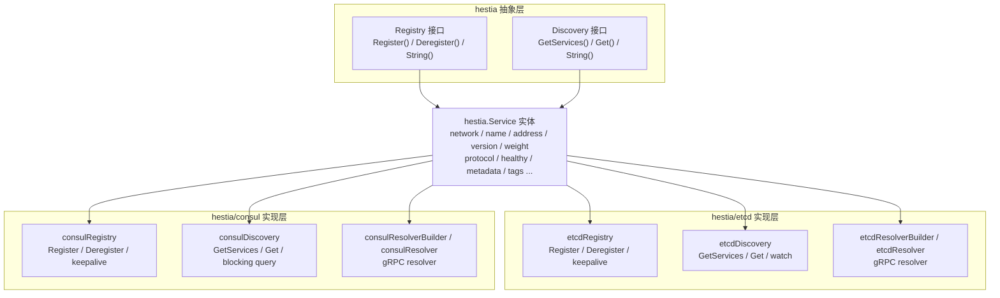
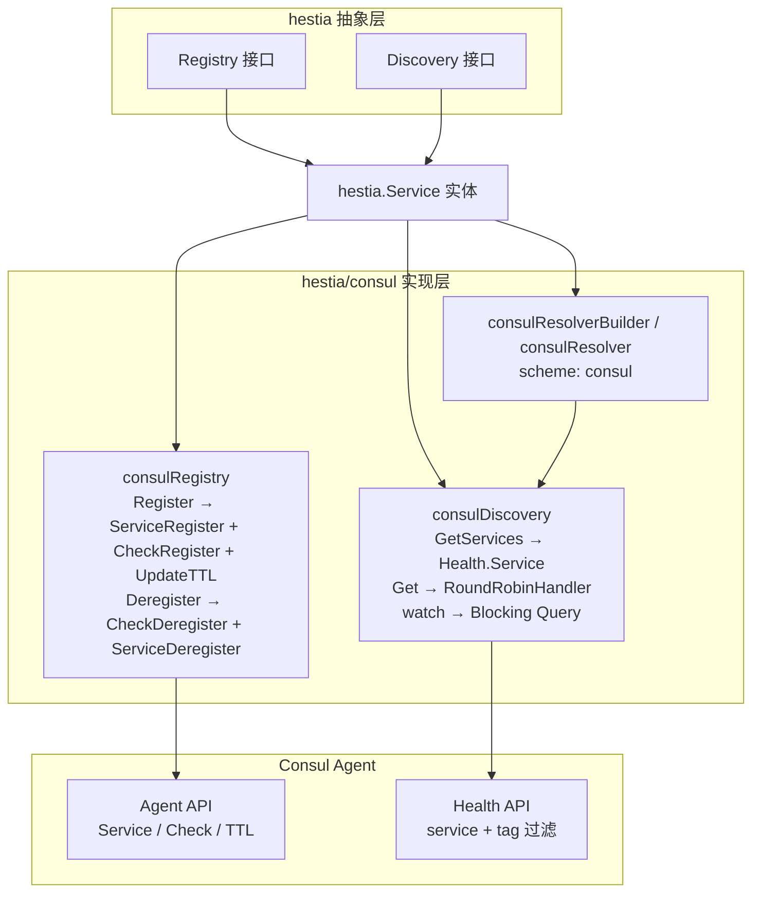

# hestia

名字起源于希腊神话人物：赫斯提亚（Hestia）。具有以下含义：

1. 背景‌：炉灶与家庭女神，守护家庭稳定。
2. 寓意‌：适合服务注册的持久性和稳定性保障模块。

因此使用它，作为服务发现和注册的名字，强调服务状态的实时可见性。

`hestia` 是 `hephfx` 项目下的服务注册与服务发现模块，基于 Go 语言实现，内置 etcd 和 Consul 两种注册中心实现。

## 目录

- [核心特性](#核心特性)
- [架构设计](#架构设计)
- [快速开始](#快速开始)
- [服务端服务注册](#服务端服务注册)
- [客户端服务发现和调用](#客户端服务发现和调用)
- [gRPC 服务发现](#grpc-服务发现)
- [Consul 实现服务注册发现和 gRPC Resolver 使用](#consul-实现服务注册发现和-grpc-resolver-使用)
- [Kubernetes 部署建议](#kubernetes-部署建议)
- [注意事项](#注意事项)
- [许可证](#许可证)

## 核心特性

- **接口化设计**：定义 `hestia.Registry` 和 `hestia.Discovery` 接口，便于扩展不同的注册中心实现（etcd、Consul 等）。
- **etcd 实现**：基于 `go.etcd.io/etcd/client/v3` 实现服务注册与发现，利用 etcd lease 机制实现自动过期与心跳保活。
- **Consul 实现**：基于 `hashicorp/consul/api` 实现服务注册与发现，采用 TTL 健康检查 + 心跳保活机制，借助 Consul 原生 Health API 与 blocking query 实现服务过滤与实时监听。
- **服务元数据**：`hestia.Service` 支持 `network`、`name`、`address`、`naming_address`、`version`、`weight`、`protocol`、`healthy`、`metadata`、`tags` 等字段。
- **版本隔离**：支持按 `version` 注册和发现服务，便于多版本共存。
- **地址自动解析**：`hestia.Resolve` 可自动将 `:port` 或 `::` 解析为本机 IPv4 地址。
- **负载均衡策略**：内置轮询策略 `hestia.RoundRobinHandler`，发现端支持传入自定义 `StrategyHandler`。
- **watch 监听**：可选启用实时监听感知服务上下线变化（默认关闭，通过 `WithEnableWatched` 开启）。etcd 使用 watch channel，Consul 使用 blocking query。
- **认证支持**：etcd 实现支持通过用户名/密码连接注册中心，Consul 实现支持通过 ACL token 鉴权。
- **gRPC Resolver**：同时提供基于 etcd 和 Consul 的 gRPC resolver，客户端可通过 `etcd:///service/version` 或 `consul:///service/version` 直接访问服务。

## 架构设计



### 存储结构

**etcd 实现**：服务实例以 JSON 格式存储在 etcd 中。

```text
/{prefix}/{serviceName}/{version}/{instanceID}
```

默认 `prefix` 为 `/hestia/registry-etcd`。

**Consul 实现**：服务信息通过 Consul Agent API 注册，核心字段映射如下：

| hestia 字段 | Consul 字段 | 说明 |
|---|---|---|
| `InstanceID` | `AgentServiceRegistration.ID` | 服务唯一标识 |
| `Name` | `AgentServiceRegistration.Name` | Consul 服务名 |
| `Address` | `AgentServiceRegistration.Address` + `Port` | 主机与端口分离存储 |
| `Version` | `Tags` 中 `hestia-version=v1` | 标签过滤 |
| `Metadata/Tags` | `Meta` 中 `meta_xxx` / `tag_xxx` | 自定义元数据 |

### 核心接口

```go
// Registry 服务注册接口
type Registry interface {
    Register(ctx context.Context, s *Service) error
    Deregister(ctx context.Context, s *Service) error
    String() string
}

// Discovery 服务发现接口
type Discovery interface {
    GetServices(ctx context.Context, name string, version string) ([]*Service, error)
    Get(ctx context.Context, name string, version string, strategyHandler ...StrategyHandler) (*Service, error)
    String() string
}
```

## 快速开始

### 环境要求

- Go >= 1.25.0
- etcd >= 3.x

### 启动 etcd

本地开发可使用 Docker 快速启动一个 etcd 节点：

```bash
docker run -d --name etcd \
  -p 12379:2379 \
  -p 12380:2380 \
  quay.io/coreos/etcd:v3.5.18 \
  /usr/local/bin/etcd \
  --listen-client-urls http://0.0.0.0:2379 \
  --advertise-client-urls http://0.0.0.0:2379
```

### 安装依赖

```bash
go get github.com/daheige/hephfx/hestia
```

## 服务端服务注册

```go
package main

import (
    "context"
    "log"
    "time"

    "github.com/daheige/hephfx/hestia"
    "github.com/daheige/hephfx/hestia/etcd"
)

func main() {
    ctx := context.Background()

    // 创建注册中心实例
    registry, err := etcd.NewRegistry([]string{
        "http://127.0.0.1:12379",
    })
    if err != nil {
        log.Fatalf("create registry error: %v", err)
    }

    // 构造服务信息
    svc := &hestia.Service{
        Network:  "tcp",
        Name:     "my-service",
        Address:  ":8080", // 空 host 会自动解析为本机 IPv4
        Version:  "v1",
        Weight:   100,                          // 权重，默认 100，0 表示不参与负载均衡
        Protocol: hestia.ProtocolHTTP,          // 协议类型：GRPC / HTTP
        Created:  time.Now().Format("2006-01-02 15:04:05"),
        Metadata: map[string]interface{}{
            "region": "cn-north-1",
        },
        Tags: map[string]string{
            "env": "prod",
        },
    }

    // 注册服务，注册成功后 svc.Healthy 会被置为 true，Weight 为 0 时自动默认为 100
    if err := registry.Register(ctx, svc); err != nil {
        log.Fatalf("register service error: %v", err)
    }

    log.Printf("service registered, instance_id: %s", svc.InstanceID)

    // 保持运行，退出时注销
    select {}

    // 应用退出时注销服务
    _ = registry.Deregister(ctx, svc)
}
```

### 注册可选项

```go
registry, err := etcd.NewRegistry(
    []string{"http://127.0.0.1:12379"},
    etcd.WithDialTimeout(10*time.Second),
    etcd.WithLeaseTTL(60),
    etcd.WithPrefix("/myapp/registry"),
    etcd.WithUsername("root"),
    etcd.WithPassword("root"),
)
```

## 客户端服务发现和调用

```go
package main

import (
    "context"
    "log"

    "github.com/daheige/hephfx/hestia"
    "github.com/daheige/hephfx/hestia/etcd"
)

func main() {
    ctx := context.Background()

    discovery, err := etcd.NewDiscovery([]string{
        "http://127.0.0.1:12379",
    })
    if err != nil {
        log.Fatalf("create discovery error: %v", err)
    }

    // 获取全部服务实例
    // 仅返回 Healthy=true 且 Weight>0 的实例；Weight 为 0 表示该实例不参与负载均衡
    services, err := discovery.GetServices(ctx, "my-service", "v1")
    if err != nil {
        log.Fatalf("get services error: %v", err)
    }
    log.Printf("services: %+v", services)

    // 使用内置轮询策略获取一个可用实例
    svc, err := discovery.Get(ctx, "my-service", "v1")
    if err != nil {
        log.Fatalf("get service error: %v", err)
    }
    log.Printf("selected service: %s://%s", svc.Network, svc.Address)

    // 也可以传入自定义策略
    svc, err = discovery.Get(ctx, "my-service", "v1", func(list []*hestia.Service) *hestia.Service {
        if len(list) == 0 {
            return nil
        }
        return list[0]
    })
    if err != nil {
        log.Fatalf("get service error: %v", err)
    }
}
```

### 启用 watch 监听

默认情况下，`GetServices` 每次都会从 etcd 读取最新数据。如需启用本地缓存并通过 watch 实时刷新，可配置：

```go
discovery, err := etcd.NewDiscovery(
    []string{"http://127.0.0.1:12379"},
    etcd.WithEnableWatched(),
)
```

启用后，首次获取某服务列表时会启动 goroutine 监听对应前缀的变更，并在本地缓存中更新服务列表。

## gRPC 服务发现

`hestia/etcd` 提供了 gRPC resolver，支持通过 `etcd:///service_name/version` 形式的 target 直接发现服务。

### 全局注册 resolver

```go
package main

import (
    "context"
    "log"

    "google.golang.org/grpc"
    "google.golang.org/grpc/credentials/insecure"

    "github.com/daheige/hephfx/hestia/etcd"
)

func main() {
    discovery, err := etcd.NewDiscovery([]string{
        "http://127.0.0.1:12379",
    })
    if err != nil {
        log.Fatal(err)
    }

    // scheme 固定为 "etcd"
    etcd.RegisterEtcdResolver(discovery)

    conn, err := grpc.NewClient(
        "etcd:///order_service/v1",
        grpc.WithDefaultServiceConfig(`{"loadBalancingConfig": [{"round_robin":{}}]}`),
        grpc.WithTransportCredentials(insecure.NewCredentials()),
    )
    if err != nil {
        log.Fatal(err)
    }
    defer conn.Close()

    // 使用 conn 创建 gRPC client 并发起调用...
    _ = conn
}
```

### 显式注入 resolver.Builder

```go
builder := etcd.NewEtcdResolverBuilder(discovery)
resolver.Register(builder)
```

### target 格式说明

- `etcd:///order_service/v1`：服务名 `order_service`，版本 `v1`。
- `etcd:///order_service`：服务名 `order_service`，版本为空。
- resolver 仅使用 `Protocol` 为空或 `hestia.ProtocolGRPC` 的服务实例；HTTP 服务不会被纳入 gRPC 地址列表。
- resolver 内部优先复用 `etcdDiscovery` 的 watch 能力感知变更；若传入的 discovery 不是 etcd 实现，则退化为 10 秒轮询。

## Consul 实现服务注册发现和 gRPC Resolver 使用

`hestia/consul` 是基于 HashiCorp Consul 的服务注册与服务发现实现，同样实现了 `hestia.Registry` 和 `hestia.Discovery` 接口，并提供 gRPC resolver 支持。与 etcd 实现相比，Consul 在服务健康检查方面更加成熟，内置 TTL check 机制和 blocking query 变更监听。

### 快速开始

**环境要求**：

- Go >= 1.26.0（受 `hashicorp/consul/api` 依赖约束）
- Consul >= 1.x

**启动 Consul**：

```bash
docker run -d --name consul \
  -p 8500:8500 \
  hashicorp/consul:latest
```

**安装依赖**：

```bash
go get github.com/daheige/hephfx/hestia/consul
```

### 架构设计



**核心区别**：Consul 使用 Agent API 管理服务（而非 etcd 的 KV 存储），使用 TTL check（而非 lease 续约），watch 使用 blocking query（而非 etcd watch channel）。接口层面完全兼容，业务代码无需修改即可切换注册中心。

### 服务端服务注册

```go
package main

import (
    "context"
    "log"
    "time"

    "github.com/daheige/hephfx/hestia"
    "github.com/daheige/hephfx/hestia/consul"
)

func main() {
    ctx := context.Background()

    // 创建 Consul 注册中心实例
    registry, err := consul.NewRegistry([]string{
        "127.0.0.1:8500",
    })
    if err != nil {
        log.Fatalf("create registry error: %v", err)
    }

    // 构造服务信息（与 etcd 完全相同的 hestia.Service）
    svc := &hestia.Service{
        Network:  "tcp",
        Name:     "my-service",
        Address:  ":8080",
        Version:  "v1",
        Weight:   100,
        Protocol: hestia.ProtocolHTTP,
        Created:  time.Now().Format("2006-01-02 15:04:05"),
        Metadata: map[string]interface{}{
            "region": "cn-north-1",
        },
        Tags: map[string]string{
            "env": "prod",
        },
    }

    if err := registry.Register(ctx, svc); err != nil {
        log.Fatalf("register service error: %v", err)
    }

    log.Printf("service registered, instance_id: %s", svc.InstanceID)

    select {}

    _ = registry.Deregister(ctx, svc)
}
```

**注册可选项**：

```go
registry, err := consul.NewRegistry(
    []string{"127.0.0.1:8500"},
    consul.WithDialTimeout(10*time.Second),              // 连接超时
    consul.WithTTL("30s"),                               // TTL 健康检查间隔
    consul.WithDeregisterCriticalServiceAfter("90s"),    // critical 后自动注销时间
    consul.WithPrefix("hestia"),                         // 服务名前缀
    consul.WithToken("your-acl-token"),                  // ACL token
    consul.WithValidateAddress(true),                    // 注册时校验地址有效性
)
```

**注册流程**：Register 分三步——先注册 service，再注册 check，最后初始 TTL pass。任何一步失败都会回滚已执行的操作，确保 Consul 中不留残留数据。注册成功后启动 keepalive goroutine，以 TTL/3 间隔定期心跳保活。

### 客户端服务发现和调用

```go
package main

import (
    "context"
    "log"

    "github.com/daheige/hephfx/hestia"
    "github.com/daheige/hephfx/hestia/consul"
)

func main() {
    ctx := context.Background()

    discovery, err := consul.NewDiscovery([]string{
        "127.0.0.1:8500",
    })
    if err != nil {
        log.Fatalf("create discovery error: %v", err)
    }

    // 获取全部服务实例（Health API 自动过滤非 passing 实例）
    services, err := discovery.GetServices(ctx, "my-service", "v1")
    if err != nil {
        log.Fatalf("get services error: %v", err)
    }
    log.Printf("services count: %d", len(services))

    // 使用内置轮询策略获取一个可用实例
    svc, err := discovery.Get(ctx, "my-service", "v1")
    if err != nil {
        log.Fatalf("get service error: %v", err)
    }
    log.Printf("selected service: %s://%s", svc.Network, svc.Address)

    // 自定义策略
    svc, err = discovery.Get(ctx, "my-service", "v1", func(list []*hestia.Service) *hestia.Service {
        if len(list) == 0 {
            return nil
        }
        return list[0]
    })
    if err != nil {
        log.Fatalf("get service error: %v", err)
    }
}
```

**启用 blocking query 监听**：

```go
discovery, err := consul.NewDiscovery(
    []string{"127.0.0.1:8500"},
    consul.WithEnableWatched(),
)
```

启用后，首次获取某服务列表时会启动 goroutine 通过 blocking query（`WaitTime=5min`）持续监听变更，相比轮询更节省连接资源：请求长时间挂起，仅在服务列表变化或超时时返回。

### gRPC Resolver

Consul 实现的 gRPC resolver 构建在 `hestia.Discovery` 接口之上，scheme 固定为 `consul`：

```go
package main

import (
    "log"

    "google.golang.org/grpc"
    "google.golang.org/grpc/credentials/insecure"

    "github.com/daheige/hephfx/hestia/consul"
)

func main() {
    discovery, err := consul.NewDiscovery([]string{
        "127.0.0.1:8500",
    })
    if err != nil {
        log.Fatal(err)
    }

    // 全局注册 consul resolver
    consul.RegisterConsulResolver(discovery)

    conn, err := grpc.NewClient(
        "consul:///order_service/v1",
        grpc.WithDefaultServiceConfig(`{"loadBalancingConfig": [{"round_robin":{}}]}`),
        grpc.WithTransportCredentials(insecure.NewCredentials()),
    )
    if err != nil {
        log.Fatal(err)
    }
    defer conn.Close()

    // 使用 conn 创建 gRPC client 并发起调用...
    _ = conn
}
```

也可以显式注入 resolver.Builder：

```go
builder := consul.NewConsulResolverBuilder(discovery)
resolver.Register(builder)
```

**target 格式**：

- `consul:///order_service/v1`：服务名 `order_service`，版本 `v1`
- `consul:///order_service`：服务名 `order_service`，版本为空
- resolver 仅将 `Protocol` 为空或 `hestia.ProtocolGRPC` 的实例纳入地址列表
- 当传入的 discovery 是 `*consulDiscovery` 时，resolver 直接复用其 blocking query 能力实时感知变更；否则退化为 10 秒轮询
- 服务暂时不存在时不会报错，返回空地址列表并持续监听，服务注册后自动更新

### 与 etcd 实现的核心差异

| 维度 | etcd | Consul |
|---|---|---|
| 存储模型 | KV 存储，JSON 值 | Agent Service API |
| 健康检查 | Lease 续约（keepalive） | TTL Check + Agent UpdateTTL |
| 服务查询 | Get + WithPrefix | Health.Service(tag 过滤) |
| 变更监听 | Watch channel | Blocking Query (long polling) |
| 认证方式 | 用户名/密码 | ACL Token |
| 地址格式 | `http://host:port` | `host:port` |
| 注销行为 | 撤销 lease，KV 自动过期 | CheckDeregister + ServiceDeregister |
| 异常宕机 | Lease 到期后 Key 删除 | TTL 到期 → critical → 自动注销 |
| Go 版本要求 | >= 1.25.0 | >= 1.26.0 |

## Kubernetes 部署建议

在 K8s 中注册服务时，最可靠的方式是通过 **Downward API 注入 Pod IP**，而不是依赖 `hestia.Resolve(":port")` 自动推导本机 IP。

### 为什么不建议依赖自动推导

`hestia.Resolve` 在 host 为空时会调用 `localIPv4Host()` 取第一个非 loopback 的 IPv4。在 K8s Pod 里，若存在多网卡、sidecar（如 Istio）或特殊 CNI 配置，取到的地址可能不是预期的 Pod IP。

### 推荐做法

在 Deployment/StatefulSet 中注入 Pod IP：

```yaml
env:
  - name: POD_IP
    valueFrom:
      fieldRef:
        fieldPath: status.podIP
```
ip地址获取方式如下：
```go
podIP := os.Getenv("POD_IP")
if podIP == "" {
    // 非 K8s 环境回退
    podIP = hestia.LocalAddr()
}
```

服务启动注册时：

```go
svc := &hestia.Service{
    Network: "tcp",
    Name:    "my-service",
    Address: os.Getenv("POD_IP") + ":8080",
    Version: "v1",
}

if err := registry.Register(ctx, svc); err != nil {
    log.Fatalf("register service error: %v", err)
}
```

### headless service 场景

如果希望通过 DNS 发现，可直接把 headless service 的 DNS 作为 `Address` 或 `NamingAddress`：

```go
svc := &hestia.Service{
    Name:    "my-service",
    Address: "my-service.default.svc.cluster.local:8080",
    Version: "v1",
}
```

此时 `hestia.Resolve` 会原样返回该地址，连接时由 gRPC/DNS 解析为 Pod IP。

### Consul agent 部署模式

使用 Consul 作为注册中心时，推荐在每个 Node 上以 DaemonSet 运行 Consul client agent，Pod 通过 `localhost:8500` 连接：

```go
registry, err := consul.NewRegistry([]string{
    "localhost:8500",
})
```

完整 DaemonSet + Deployment 示例：

```yaml
# consul-agent DaemonSet
apiVersion: apps/v1
kind: DaemonSet
metadata:
  name: consul-agent
  namespace: kube-system
spec:
  selector:
    matchLabels:
      app: consul-agent
  template:
    metadata:
      labels:
        app: consul-agent
    spec:
      hostNetwork: true
      containers:
        - name: consul-agent
          image: hashicorp/consul:1.20
          args:
            - "agent"
            - "-bind=0.0.0.0"
            - "-client=0.0.0.0"
            - "-retry-join=consul-server.default.svc.cluster.local"
          ports:
            - containerPort: 8500
              hostPort: 8500
---
# 应用 Deployment
apiVersion: apps/v1
kind: Deployment
metadata:
  name: my-service
spec:
  replicas: 3
  selector:
    matchLabels:
      app: my-service
  template:
    metadata:
      labels:
        app: my-service
    spec:
      containers:
        - name: app
          image: my-service:latest
          env:
            - name: POD_IP
              valueFrom:
                fieldRef:
                  fieldPath: status.podIP
          ports:
            - containerPort: 8080
```

## 注意事项

### 通用

1. **Go 版本**：`hestia/core` 要求 Go >= 1.25.0；`hestia/consul` 因 `hashicorp/consul/api` 依赖约束，要求 Go >= 1.26.0。
2. **watch 默认关闭**：出于简单性考虑，etcd 和 Consul 实现均默认 `disableWatch` 为 `true`。生产环境中需要实时感知服务变化时，建议通过 `WithEnableWatched()` 开启。etcd 使用 watch channel，Consul 使用 blocking query。
3. **地址解析**：注册时 `Address` 为空 host（如 `:8080`）或 `::` 时，会自动解析为本机第一个非回环 IPv4 地址。K8s 生产环境建议通过 Downward API 显式注入 Pod IP。
4. **并发安全**：etcd 和 Consul 的 Discovery 实现内部均使用读写锁保护服务列表缓存，可安全并发调用 `GetServices` 和 `Get`。
5. **错误处理**：当目标服务没有任何可用实例时，`GetServices` 返回 `hestia.ErrServicesNotFound`。
6. **字段默认值**：注册时若 `Weight` 为 0，自动设置为 100；`Healthy` 在注册成功后为 `true`，注销后为 `false`；`InstanceID` 为空时自动生成 UUID。
7. **协议类型**：`Protocol` 支持 `hestia.ProtocolGRPC` 和 `hestia.ProtocolHTTP`，gRPC resolver 会自动过滤掉非 GRPC 的实例。
8. **gRPC resolver 空列表**：服务暂时不存在时，resolver 不会直接失败，而是返回空地址列表并持续监听；待服务注册后会自动更新。
9. **接口兼容**：etcd 和 Consul 实现均遵循 `hestia.Registry` 和 `hestia.Discovery` 接口，业务代码切换注册中心无需修改，仅需替换 import 路径和配置参数。

### etcd 实现

10. **etcd 版本**：`hestia/etcd` 基于 etcd v3 client 实现，请确保服务端为 etcd 3.x。
11. **lease TTL**：默认 lease 有效期为 60 秒，注册成功后自动发起 keepalive 续租。可通过 `WithLeaseTTL` 调整。
12. **prefix 格式**：`WithPrefix` 传入的值前后 `/` 不影响最终效果，实现层自动规范为 `/{prefix}`。
13. **服务注销**：`Deregister` 取消 keepalive context，调用后不再续租，etcd 在 lease 到期后自动清理。
14. **认证**：支持通过 `WithUsername` / `WithPassword` 连接 etcd。

### Consul 实现

15. **Consul 版本**：基于 `hashicorp/consul/api` v1 实现，兼容 Consul 1.x 服务端。
16. **注册流程**：Register 分三步——先注册 service，再注册 check，最后初始 TTL pass。任何一步失败都会回滚，确保不留残留数据。
17. **心跳间隔**：默认 TTL 为 30 秒，心跳间隔为 TTL/3 = 10 秒。TTL 越短故障检测越及时，但对 Consul agent 压力越大。心跳间隔最小为 1 秒。TTL 值支持 `time.ParseDuration` 格式（如 `"30s"`、`"1m"`）。
18. **deregisterCriticalServiceAfter**：默认 90 秒（3 倍 TTL），必须大于 TTL，否则正常心跳间隙可能被误注销。
19. **服务注销**：`Deregister` 先停止 keepalive goroutine（退出前 best-effort 发送 `failing` 状态），再依次注销 check 和 service。若异常宕机未调用 `Deregister`，TTL 到期后 Consul 自动标记 critical 并最终注销。
20. **版本过滤**：版本号以 `hestia-version=v1` 格式存储为 Consul tag，Health API 基于 tag 精准匹配，`passingOnly=true` 自动排除非健康实例。
21. **endpoint 格式**：`NewRegistry` 和 `NewDiscovery` 接受 `host:port` 或 `http://host:port` 格式，实现层自动去除前缀。
22. **认证**：支持通过 `WithToken` 配置 ACL token。

## 许可证

本项目采用 [MIT License](../LICENSE) 开源协议。
