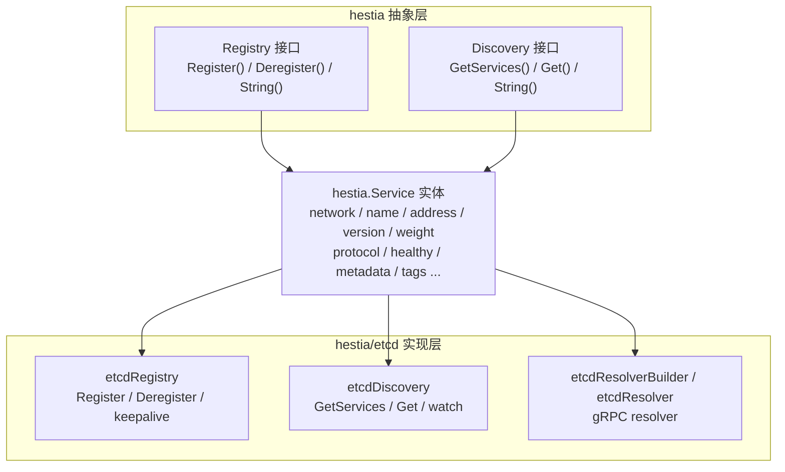

# hestia

名字起源于希腊神话人物：赫斯提亚（Hestia）。具有以下含义：

1. 背景‌：炉灶与家庭女神，守护家庭稳定。
2. 寓意‌：适合服务注册的持久性和稳定性保障模块。

因此使用它，作为服务发现和注册的名字，强调服务状态的实时可见性。

`hestia` 是 `hephfx` 项目下的服务注册与服务发现模块，基于 Go 语言实现，目前内置 etcd 作为注册中心。

## 目录

- [核心特性](#核心特性)
- [架构设计](#架构设计)
- [快速开始](#快速开始)
- [服务端服务注册](#服务端服务注册)
- [客户端服务发现和调用](#客户端服务发现和调用)
- [gRPC 服务发现](#grpc-服务发现)
- [Kubernetes 部署建议](#kubernetes-部署建议)
- [注意事项](#注意事项)
- [许可证](#许可证)

## 核心特性

- **接口化设计**：定义 `hestia.Registry` 和 `hestia.Discovery` 接口，便于扩展不同的注册中心实现。
- **etcd 实现**：基于 `go.etcd.io/etcd/client/v3` 实现服务注册与发现，利用 etcd lease 机制实现自动过期与心跳保活。
- **服务元数据**：`hestia.Service` 支持 `network`、`name`、`address`、`naming_address`、`version`、`weight`、`protocol`、`healthy`、`metadata`、`tags` 等字段。
- **版本隔离**：支持按 `version` 注册和发现服务，便于多版本共存。
- **地址自动解析**：`hestia.Resolve` 可自动将 `:port` 或 `::` 解析为本机 IPv4 地址。
- **负载均衡策略**：内置轮询策略 `hestia.RoundRobinHandler`，发现端支持传入自定义 `StrategyHandler`。
- **watch 监听**：可选启用 etcd watch 实时感知服务上下线变化（默认关闭，通过 `WithEnableWatched` 开启）。
- **认证支持**：etcd 实现支持通过用户名/密码连接注册中心。
- **gRPC Resolver**：提供基于 etcd 的 gRPC resolver，客户端可通过 `etcd:///service/version` 直接访问服务。

## 架构设计



### 存储结构

服务实例在 etcd 中的 key 格式如下：

```text
/{prefix}/{serviceName}/{version}/{instanceID}
```

默认 `prefix` 为 `/hestia/registry-etcd`。value 为 `hestia.Service` 序列化后的 JSON 数据。

### 核心接口

```go
// Registry 服务注册接口
type Registry interface {
    Register(ctx context.Context, s *Service) error
    Deregister(ctx context.Context, s *Service) error
    String() string
}

// Discovery 服务发现接口
type Discovery interface {
    GetServices(ctx context.Context, name string, version string) ([]*Service, error)
    Get(ctx context.Context, name string, version string, strategyHandler ...StrategyHandler) (*Service, error)
    String() string
}
```

## 快速开始

### 环境要求

- Go >= 1.25.0
- etcd >= 3.x

### 启动 etcd

本地开发可使用 Docker 快速启动一个 etcd 节点：

```bash
docker run -d --name etcd \
  -p 12379:2379 \
  -p 12380:2380 \
  quay.io/coreos/etcd:v3.5.18 \
  /usr/local/bin/etcd \
  --listen-client-urls http://0.0.0.0:2379 \
  --advertise-client-urls http://0.0.0.0:2379
```

### 安装依赖

```bash
go get github.com/daheige/hephfx/hestia
```

## 服务端服务注册

```go
package main

import (
    "context"
    "log"
    "time"

    "github.com/daheige/hephfx/hestia"
    "github.com/daheige/hephfx/hestia/etcd"
)

func main() {
    ctx := context.Background()

    // 创建注册中心实例
    registry, err := etcd.NewRegistry([]string{
        "http://127.0.0.1:12379",
    })
    if err != nil {
        log.Fatalf("create registry error: %v", err)
    }

    // 构造服务信息
    svc := &hestia.Service{
        Network:  "tcp",
        Name:     "my-service",
        Address:  ":8080", // 空 host 会自动解析为本机 IPv4
        Version:  "v1",
        Weight:   100,                          // 权重，默认 100，0 表示不参与负载均衡
        Protocol: hestia.ProtocolHTTP,          // 协议类型：GRPC / HTTP
        Created:  time.Now().Format("2006-01-02 15:04:05"),
        Metadata: map[string]interface{}{
            "region": "cn-north-1",
        },
        Tags: map[string]string{
            "env": "prod",
        },
    }

    // 注册服务，注册成功后 svc.Healthy 会被置为 true，Weight 为 0 时自动默认为 100
    if err := registry.Register(ctx, svc); err != nil {
        log.Fatalf("register service error: %v", err)
    }

    log.Printf("service registered, instance_id: %s", svc.InstanceID)

    // 保持运行，退出时注销
    select {}

    // 应用退出时注销服务
    _ = registry.Deregister(ctx, svc)
}
```

### 注册可选项

```go
registry, err := etcd.NewRegistry(
    []string{"http://127.0.0.1:12379"},
    etcd.WithDialTimeout(10*time.Second),
    etcd.WithLeaseTTL(60),
    etcd.WithPrefix("/myapp/registry"),
    etcd.WithUsername("root"),
    etcd.WithPassword("root"),
)
```

## 客户端服务发现和调用

```go
package main

import (
    "context"
    "log"

    "github.com/daheige/hephfx/hestia"
    "github.com/daheige/hephfx/hestia/etcd"
)

func main() {
    ctx := context.Background()

    discovery, err := etcd.NewDiscovery([]string{
        "http://127.0.0.1:12379",
    })
    if err != nil {
        log.Fatalf("create discovery error: %v", err)
    }

    // 获取全部服务实例
    // 仅返回 Healthy=true 且 Weight>0 的实例；Weight 为 0 表示该实例不参与负载均衡
    services, err := discovery.GetServices(ctx, "my-service", "v1")
    if err != nil {
        log.Fatalf("get services error: %v", err)
    }
    log.Printf("services: %+v", services)

    // 使用内置轮询策略获取一个可用实例
    svc, err := discovery.Get(ctx, "my-service", "v1")
    if err != nil {
        log.Fatalf("get service error: %v", err)
    }
    log.Printf("selected service: %s://%s", svc.Network, svc.Address)

    // 也可以传入自定义策略
    svc, err = discovery.Get(ctx, "my-service", "v1", func(list []*hestia.Service) *hestia.Service {
        if len(list) == 0 {
            return nil
        }
        return list[0]
    })
    if err != nil {
        log.Fatalf("get service error: %v", err)
    }
}
```

### 启用 watch 监听

默认情况下，`GetServices` 每次都会从 etcd 读取最新数据。如需启用本地缓存并通过 watch 实时刷新，可配置：

```go
discovery, err := etcd.NewDiscovery(
    []string{"http://127.0.0.1:12379"},
    etcd.WithEnableWatched(),
)
```

启用后，首次获取某服务列表时会启动 goroutine 监听对应前缀的变更，并在本地缓存中更新服务列表。

## gRPC 服务发现

`hestia/etcd` 提供了 gRPC resolver，支持通过 `etcd:///service_name/version` 形式的 target 直接发现服务。

### 全局注册 resolver

```go
package main

import (
    "context"
    "log"

    "google.golang.org/grpc"
    "google.golang.org/grpc/credentials/insecure"

    "github.com/daheige/hephfx/hestia/etcd"
)

func main() {
    discovery, err := etcd.NewDiscovery([]string{
        "http://127.0.0.1:12379",
    })
    if err != nil {
        log.Fatal(err)
    }

    // scheme 固定为 "etcd"
    etcd.RegisterEtcdResolver(discovery)

    conn, err := grpc.NewClient(
        "etcd:///order_service/v1",
        grpc.WithDefaultServiceConfig(`{"loadBalancingConfig": [{"round_robin":{}}]}`),
        grpc.WithTransportCredentials(insecure.NewCredentials()),
    )
    if err != nil {
        log.Fatal(err)
    }
    defer conn.Close()

    // 使用 conn 创建 gRPC client 并发起调用...
    _ = conn
}
```

### 显式注入 resolver.Builder

```go
builder := etcd.NewEtcdResolverBuilder(discovery)
resolver.Register(builder)
```

### target 格式说明

- `etcd:///order_service/v1`：服务名 `order_service`，版本 `v1`。
- `etcd:///order_service`：服务名 `order_service`，版本为空。
- resolver 仅使用 `Protocol` 为空或 `hestia.ProtocolGRPC` 的服务实例；HTTP 服务不会被纳入 gRPC 地址列表。
- resolver 内部优先复用 `etcdDiscovery` 的 watch 能力感知变更；若传入的 discovery 不是 etcd 实现，则退化为 10 秒轮询。

## Kubernetes 部署建议

在 K8s 中注册服务时，最可靠的方式是通过 **Downward API 注入 Pod IP**，而不是依赖 `hestia.Resolve(":port")` 自动推导本机 IP。

### 为什么不建议依赖自动推导

`hestia.Resolve` 在 host 为空时会调用 `localIPv4Host()` 取第一个非 loopback 的 IPv4。在 K8s Pod 里，若存在多网卡、sidecar（如 Istio）或特殊 CNI 配置，取到的地址可能不是预期的 Pod IP。

### 推荐做法

在 Deployment/StatefulSet 中注入 Pod IP：

```yaml
env:
  - name: POD_IP
    valueFrom:
      fieldRef:
        fieldPath: status.podIP
```
ip地址获取方式如下：
```go
podIP := os.Getenv("POD_IP")
if podIP == "" {
    // 非 K8s 环境回退
    podIP = hestia.LocalAddr()
}
```

服务启动注册时：

```go
svc := &hestia.Service{
    Network: "tcp",
    Name:    "my-service",
    Address: os.Getenv("POD_IP") + ":8080",
    Version: "v1",
}

if err := registry.Register(ctx, svc); err != nil {
    log.Fatalf("register service error: %v", err)
}
```

### headless service 场景

如果希望通过 DNS 发现，可直接把 headless service 的 DNS 作为 `Address` 或 `NamingAddress`：

```go
svc := &hestia.Service{
    Name:    "my-service",
    Address: "my-service.default.svc.cluster.local:8080",
    Version: "v1",
}
```

此时 `hestia.Resolve` 会原样返回该地址，连接时由 gRPC/DNS 解析为 Pod IP。

## 注意事项

1. **Go 版本**：本项目要求 Go >= 1.25.0。
2. **etcd 版本**：`hestia/etcd` 基于 etcd v3 client 实现，请确保服务端为 etcd 3.x。
3. **watch 默认关闭**：出于简单性考虑，默认 `disableWatch` 为 `true`。生产环境中如果需要实时感知服务变化，建议通过 `WithEnableWatched()` 开启。
4. **服务注销**：`Deregister` 会取消 keepalive context，调用后该注册实例不再续租，etcd 会在 lease 到期后自动清理。
5. **地址解析**：注册时 `Address` 为空 host（如 `:8080`）或 `::` 时，会自动解析为本机第一个非回环 IPv4 地址。K8s 生产环境建议通过 Downward API 显式注入 Pod IP。
6. **lease TTL**：默认 lease 有效期为 60 秒，注册成功后会自动发起 keepalive 续租。可根据实际网络环境通过 `WithLeaseTTL` 调整。
7. **prefix 格式**：`WithPrefix` 传入的值前后 `/` 不影响最终效果，实现层会自动规范为 `/{prefix}`。
8. **并发安全**：`etcdDiscovery` 内部使用读写锁保护服务列表缓存，可安全并发调用 `GetServices` 和 `Get`。
9. **错误处理**：当目标服务没有任何可用实例时，`GetServices` 会返回 `hestia.ErrServicesNotFound`。
10. **字段默认值**：注册时若 `Weight` 为 0，会自动默认设置为 100；`Healthy` 在注册成功后为 `true`，注销后为 `false`。
11. **协议类型**：`Protocol` 支持 `hestia.ProtocolGRPC` 和 `hestia.ProtocolHTTP`，gRPC resolver 会自动过滤掉非 GRPC 的实例。
12. **gRPC resolver 空列表**：服务暂时不存在时，resolver 不会直接失败，而是返回空地址列表并持续监听；待服务注册后会自动更新。

## 许可证

本项目采用 [MIT License](../LICENSE) 开源协议。
