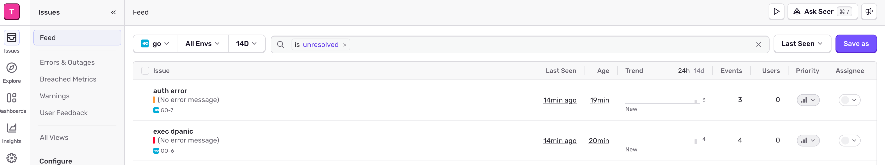

# golang logger

基于 uber zap 封装的 logger 模块，可用于 Go 应用中记录操作日志和错误日志 sentry 上报。

## 核心特性

- 支持日志自动切割和最大保留时长
- 支持日志 JSON 格式化处理
- 支持日志同时输出到文件和终端
- 支持日志打印级别和日志染色功能
- 支持自定义 zap core 注入，例如：sentry 错误上报、openobserve 日志平台上报，目前已内置 sentry 错误上报功能
- 默认初始化全局 logger，未显式调用时也可直接使用包级日志函数
- `Default` 通过 `sync.Once` 保证只初始化一次，重复调用不会覆盖
- 提供 `NewLogger` 创建独立的 logger 实例，不影响全局默认 logger

## 快速开始

### 全局默认 logger

```go
package main

import (
	"context"

	"go.uber.org/zap"

	"github.com/daheige/hephfx/logger"
)

func main() {
	// Default 只会生效一次，重复调用不会覆盖已初始化的 logger
	logger.Default(
		logger.WithJsonFormat(true),        // 默认 JSON 格式化输出
		logger.WithCallerSkip(2),           // 如果基于这个 Logger 包再封装，需要设置适当的 skip
		logger.WithLogLevel(zap.InfoLevel), // 设置日志打印最低级别，默认 info
		logger.WithStdout(true),            // 输出到终端
	)

	logger.Info(context.Background(), "hello world", "plat", "mac")
}
```

包级函数 `logger.Info/Debug/Error/...` 都依赖全局默认 logger。即使未调用 `logger.Default()`，包级函数也会使用内置默认配置（JSON、stdout、info 级别）输出日志。

### 独立 logger 实例

如果需要在同一进程中使用多组不同配置的 logger，可通过 `NewLogger` 创建独立实例，不影响全局默认 logger：

```go
myLog := logger.NewLogger(
	logger.WithLogDir("./logs"),
	logger.WithLogFilename("myapp.log"),
	logger.WithWriteToFile(true),
	logger.WithMaxAge(7),
	logger.WithMaxSize(100),
	logger.WithStdout(false),
	logger.WithJsonFormat(true),
)

myLog.Info(context.Background(), "独立 logger 输出")
```

## 常用配置项

| Option | 说明 |
| --- | --- |
| `WithJsonFormat(bool)` | 是否 JSON 格式化输出，默认 `true` |
| `WithStdout(bool)` | 是否输出到终端，默认 `true` |
| `WithLogLevel(level)` | 日志最低输出级别，默认 `zap.InfoLevel` |
| `WithCallerSkip(int)` | 调用栈跳过层数，默认 `2` |
| `WithAddCaller(bool)` | 是否输出文件名和行号 |
| `WithEnableColor(bool)` | 是否开启日志染色 |
| `WithWriteToFile(bool)` | 是否写入文件，默认 `false` |
| `WithLogDir(dir)` | 日志文件目录，默认 `./logs` |
| `WithLogFilename(name)` | 日志文件名，默认 `zap.log` |
| `WithMaxAge(days)` | 日志保留天数 |
| `WithMaxSize(MB)` | 单个日志文件最大大小（MB） |
| `WithCompress(bool)` | 是否压缩历史日志 |
| `WithHostname(hostname)` | 自定义 hostname |
| `WithCores(cores...)` | 注入自定义 zap core |
| `WithEnableSentry(bool)` | 是否开启 sentry 错误上报 |
| `WithSentryLevel(level)` | sentry 上报的最低日志级别 |
| `WithSentryFlushTimeout(d)` | sentry flush 超时时间 |

## Sentry 错误上报示例

```go
package main

import (
	"context"
	"log"
	"os"
	"time"

	"github.com/getsentry/sentry-go"
	"go.uber.org/zap"

	"github.com/daheige/hephfx/logger"
)

func main() {
	err := sentry.Init(sentry.ClientOptions{
		Dsn: os.Getenv("SENTRY_DSN"),
	})
	if err != nil {
		log.Fatalf("sentry.Init: %v", err)
	}

	defer sentry.Flush(2 * time.Second)

	logger.Default(
		logger.WithJsonFormat(true),
		logger.WithCallerSkip(2),
		logger.WithLogLevel(zap.InfoLevel),
		logger.WithStdout(true),

		logger.WithEnableSentry(true),          // 开启 sentry 上报
		logger.WithSentryLevel(zap.ErrorLevel), // 只允许 error 及以上级别上报
	)

	logger.Info(context.Background(), "hello world", "plat", "mac")
	logger.Error(context.Background(), "exec begin", "foo", "abc")
	logger.DPanic(context.Background(), "exec dpanic", "foo", "abc")
	logger.Error(context.Background(), "auth error", "uid", 1)
}
```

sentry 上报效果如下：



## 参考

- zap: https://github.com/uber-go/zap
- sentry: https://sentry.io
