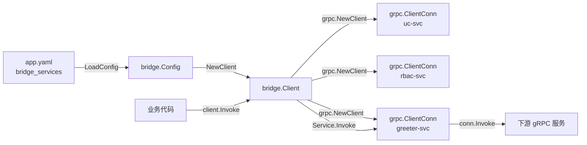

# bridge

`bridge` 是基于 YAML 配置的多下游 gRPC 客户端 SDK。它读取 `bridge_services` 服务列表，为每个下游服务创建并维护一条独立的 `grpc.ClientConn`，业务方只需按逻辑服务名即可发起 gRPC 调用，无需关心连接管理、负载均衡策略等细节。

## 核心特性

- **配置驱动**：通过 `bridge_services` 声明所有下游服务，集中管理目标地址、服务名与默认 metadata。
- **连接复用**：每个服务在 `NewClient` 时创建一条 `grpc.ClientConn`，连接可被多次调用复用。
- **按名调用**：支持短方法名（如 `SayHello`）或完整 gRPC 路径（如 `/Hello.Greeter/SayHello`）。
- **默认 Metadata**：支持为每个服务配置默认透传的 gRPC metadata。
- **灵活拨号选项**：支持全局 `grpc.DialOption` 与单服务级别的 `grpc.DialOption`。
- **内置负载均衡**：默认启用 `round_robin`，适配 K8s headless service 等场景。

## 架构设计



架构要点：

1. **配置层**：`bridge.Config` 承载 `bridge_services` 列表，通过 `github.com/daheige/hephfx/settings` 加载。
2. **客户端层**：`bridge.Client` 管理所有服务连接，提供按名调用的入口。
3. **服务层**：`bridge.Service` 封装单个下游服务的 `grpc.ClientConn` 与调用逻辑。
4. **传输层**：直接通过 `grpc.ClientConn.Invoke` 发起 gRPC 调用，不经过额外代理。

## 开始使用

### 安装

```bash
go get github.com/daheige/hephfx/micro/bridge
```

```go
import "github.com/daheige/hephfx/micro/bridge"
```

### 运行示例

项目已提供示例：`micro/bridge/example/main.go`。

```bash
cd micro/bridge/example
go run main.go
```

示例代码：

```go
package main

import (
    "context"
    "fmt"
    "log"
    "time"

    "github.com/daheige/hello-pb/pb"
    "google.golang.org/grpc"

    "github.com/daheige/hephfx/micro/bridge"
)

func main() {
    cfg, err := bridge.LoadConfig("./app.yaml")
    if err != nil {
        log.Fatal(err)
    }

    client, err := bridge.NewClient(cfg,
        bridge.WithServiceConfig(`{"loadBalancingConfig": [{"round_robin":{}}]}`),
        bridge.WithServiceDialOpts("greeter-svc", grpc.WithIdleTimeout(10*time.Minute)),
    )
    if err != nil {
        log.Fatal(err)
    }
    defer client.Close()

    ctx, cancel := context.WithTimeout(context.Background(), 3*time.Second)
    defer cancel()

    req := &pb.HelloReq{Name: "daheige"}
    var resp pb.HelloReply
    if err := client.Invoke(ctx, "greeter-svc", "SayHello", req, &resp); err != nil {
        log.Fatal(err)
    }

    fmt.Println("message:", resp.Message)
}
```

## 配置文件

创建 `app.yaml`：

```yaml
bridge_services:
  - name: uc-svc
    target: uc.cluster.local:8080
    service: "uc.UserService"
  - name: rbac-svc
    target: rbac.cluster.local:8080
    service: "rbac.RBAC"
  - name: greeter-svc
    target: greeter.cluster.local:8080
    service: "Hello.Greeter"
    metadata:
      x-service: "greeter"
```

字段说明：

| 字段 | 类型 | 必填 | 说明 |
|---|---|---|---|
| `name` | string | 是 | 逻辑服务名，代码中通过该名称调用。 |
| `target` | string | 是 | 下游 gRPC 地址，格式为 `host:port`。 |
| `service` | string | 否 | gRPC 完整服务名，如 `package.Service`。使用短方法名调用时必须设置。 |
| `metadata` | map[string]string | 否 | 该服务默认透传的 gRPC metadata。 |

> **注意**：`service` 为空时，短方法名调用会构造出错误路径。此时请使用完整路径调用，如 `svc.Invoke(ctx, "/Hello.Greeter/SayHello", req, &resp)`。

## API 说明

### Client

`Client` 管理一组下游服务连接。

```go
client, err := bridge.NewClient(cfg, opts...)
```

**方法：**

| 方法 | 签名 | 说明 |
|---|---|---|
| `NewClient` | `NewClient(cfg *Config, opts ...ClientOption) (*Client, error)` | 根据配置创建 Client，为每个服务建立 gRPC 连接。 |
| `Service` | `Service(name string) (*Service, error)` | 按逻辑服务名获取 `*Service`。 |
| `Invoke` | `Invoke(ctx, serviceName, method, req, resp, opts ...grpc.CallOption) error` | 按服务名 + 方法名调用下游方法。 |
| `Close` | `Close() error` | 关闭所有服务连接。 |

### ClientOption

```go
client, err := bridge.NewClient(cfg,
    bridge.WithServiceConfig(`{"loadBalancingConfig": [{"round_robin":{}}]}`),
    bridge.WithIdleTimeout(30*time.Minute),
    // bridge.WithMaxCallAttempts(3),
    bridge.WithDialOptions(grpc.WithMaxCallAttempts(3)), // 设置全局的 gRPC DialOption
    bridge.WithServiceDialOpts("greeter-svc", grpc.WithIdleTimeout(10*time.Minute)),
)
```

| 选项 | 说明 |
|---|---|
| `WithDialOptions(opts ...grpc.DialOption)` | 全局 gRPC 拨号选项，作用于所有服务。 |
| `WithIdleTimeout(d time.Duration)` | 连接空闲超时，默认 30 分钟。 |
| `WithMaxCallAttempts(n int)` | 最大调用重试次数，默认 3。 |
| `WithServiceConfig(cfg string)` | gRPC service config JSON，默认启用 `round_robin`。 |
| `WithServiceDialOpts(name string, opts ...grpc.DialOption)` | 为指定服务追加拨号选项。 |

### Service

`Service` 封装单个下游服务的连接与调用。

```go
svc, err := client.Service("greeter-svc")
if err != nil {
    log.Fatal(err)
}
```

**方法：**

| 方法 | 签名 | 说明 |
|---|---|---|
| `Invoke` | `Invoke(ctx, method, req, resp, opts ...grpc.CallOption) error` | 调用该服务下的方法，支持短方法名或完整路径。 |
| `Conn` | `Conn() *grpc.ClientConn` | 返回底层 gRPC 连接，便于高级场景使用。 |
| `Config` | `Config() ServiceConfig` | 返回该服务的配置副本。 |
| `Name` | `Name() string` | 返回逻辑服务名。 |
| `Target` | `Target() string` | 返回下游目标地址。 |
| `FullServiceName` | `FullServiceName() string` | 返回配置的 gRPC 完整服务名。 |
| `Close` | `Close() error` | 关闭该服务连接。 |

## 完整路径调用

当配置中未设置 `service` 字段，或需要显式指定完整路径时，可直接传入 `/PackageName.ServiceName/MethodName`：

```go
svc, err := client.Service("greeter-svc")
if err != nil {
    log.Fatal(err)
}

var resp pb.HelloReply
if err := svc.Invoke(ctx, "/Hello.Greeter/SayHello", req, &resp); err != nil {
    log.Fatal(err)
}
```

`client.Invoke` 也支持完整路径，但需先获取服务：

```go
var resp pb.HelloReply
if err := client.Invoke(ctx, "greeter-svc", "/Hello.Greeter/SayHello", req, &resp); err != nil {
    log.Fatal(err)
}
```

## 错误处理

```go
import "errors"

if errors.Is(err, bridge.ErrServiceNotFound) {
    // 服务名未在配置中找到
}

if st, ok := bridge.GRPCError(err); ok {
    // 提取 gRPC status code 与 message
    log.Printf("gRPC error: code=%d message=%s", st.Code(), st.Message())
}
```

常见错误：

| 错误 | 说明 |
|---|---|
| `ErrServiceNotFound` | 调用的服务名在 `bridge_services` 中不存在。 |
| gRPC status error | 下游服务返回的业务或框架错误，可通过 `bridge.GRPCError` 提取。 |

## 许可证

[MIT](../../LICENSE)
