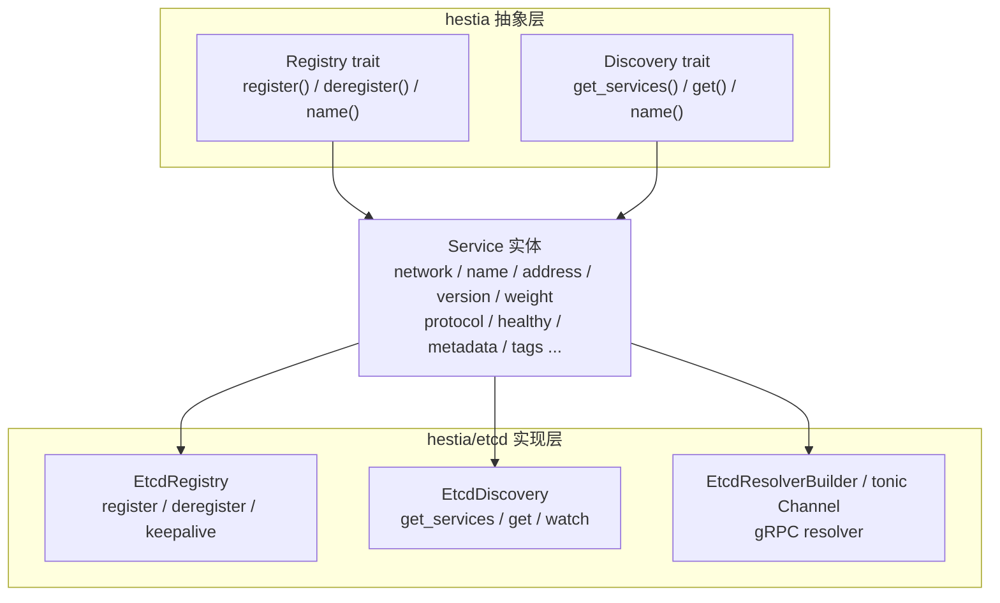

# rs-hestia

`rs-hestia` 是 `hestia` 服务注册与服务发现模块的 Rust 实现版本，名字起源于希腊神话中的炉灶与家庭女神赫斯提亚（Hestia），寓意服务状态的持久性、稳定性与实时可见性。

本 crate 保留了 Go 版 `github.com/daheige/hephfx/hestia` 的公开接口语义：`Service` 结构体、`Registry` / `Discovery` 抽象、内置负载策略、etcd 实现以及 tonic gRPC resolver。由于 `Service` 字段和 JSON 标签与 Go 版完全一致，Go 端注册的服务可以被 Rust 客户端直接消费，反之亦然。

## 目录

- [核心特性](#核心特性)
- [架构设计](#架构设计)
- [快速开始](#快速开始)
- [核心模块和用法](#核心模块和用法)
- [Context 设计和用法](#context-设计和用法)
- [虚拟机或本机使用方式](#虚拟机或本机使用方式)
- [Kubernetes 使用方式](#kubernetes-使用方式)
- [注意事项](#注意事项)
- [许可证](#许可证)

## 核心特性

- **接口化设计**：定义 `Registry` 和 `Discovery` trait，便于扩展不同的注册中心实现。
- **etcd 实现**：基于 `etcd-client` 实现服务注册与发现，利用 etcd lease 机制实现自动过期与心跳保活。
- **服务元数据**：`Service` 支持 `network`、`name`、`address`、`naming_address`、`version`、`weight`、`protocol`、`healthy`、`created`、`metadata`、`tags` 等字段。
- **版本隔离**：支持按 `version` 注册和发现服务，便于多版本共存。
- **地址自动解析**：`resolve` 可将空 host（如 `:port`）或 `::` 解析为本机 IPv4 地址。
- **负载均衡策略**：内置轮询策略 `round_robin_handler`，发现端支持传入自定义 `StrategyHandler`。
- **watch 监听**：可选启用 etcd watch 实时感知服务上下线变化（默认关闭，通过 `with_enable_watched()` 开启）。
- **认证支持**：etcd 实现支持通过用户名/密码连接注册中心。
- **gRPC Resolver**：提供基于 etcd 的 tonic resolver，客户端可通过 `etcd:///service/version` 直接访问服务。

## 架构设计



### 存储结构

服务实例在 etcd 中的 key 格式如下：

```text
/{prefix}/{serviceName}/{version}/{instanceID}
```

默认 `prefix` 为 `/hestia/registry-etcd`。value 为 `Service` 序列化后的 JSON 数据。

当 `version` 为空时，key 退化为：

```text
/{prefix}/{serviceName}/{instanceID}
```

### 核心接口

```rust
// Registry 服务注册接口
#[async_trait]
pub trait Registry: Send + Sync + Any {
    async fn register(&self, ctx: &Context, service: &mut Service) -> Result<()>;
    async fn deregister(&self, ctx: &Context, service: &mut Service) -> Result<()>;
    fn name(&self) -> &str;
}

// Discovery 服务发现接口
#[async_trait]
pub trait Discovery: Send + Sync + Any {
    async fn get_services(&self, ctx: &Context, name: &str, version: &str) -> Result<Vec<Service>>;
    async fn get(&self, ctx: &Context, name: &str, version: &str, strategy: Option<StrategyHandler>) -> Result<Service>;
    fn name(&self) -> &str;
    fn as_any(&self) -> &dyn Any;
}
```

## 快速开始

### 环境要求

- Rust >= 1.85.0（`Cargo.toml` 使用 `edition = "2024"`，建议使用最新稳定版）
- etcd >= 3.x

### 启动 etcd

本地开发可使用 Docker 快速启动一个 etcd 节点：

```bash
docker run -d --name etcd \
  -p 12379:2379 \
  -p 12380:2380 \
  quay.io/coreos/etcd:v3.5.18 \
  /usr/local/bin/etcd \
  --listen-client-urls http://0.0.0.0:2379 \
  --advertise-client-urls http://0.0.0.0:2379
```

### 添加依赖

在 `Cargo.toml` 中加入：

```toml
[dependencies]
rs-hestia = { path = "../rs-hestia" }
```

或使用 git 依赖：

```toml
rs-hestia = { git = "https://github.com/daheige/hephfx.git", branch = "main" }
```

## 核心模块和用法

### Service 结构体

```rust
use rs_hestia::{Service, ProtocolType};

let svc = Service {
    network: "tcp".to_string(),
    name: "my-service".to_string(),
    address: ":8080".to_string(),        // 空 host 会在注册时自动解析为本机 IPv4
    naming_address: "".to_string(),
    instance_id: "".to_string(),         // 为空时 register 接口自动生成 UUID
    version: "v1".to_string(),
    weight: 100,                          // 默认 100，0 表示不参与负载均衡
    protocol: ProtocolType::Http,         // Grpc / Http / Unspecified
    healthy: false,                       // 注册成功后被置为 true
    created: "2024-01-01 00:00:00".to_string(),
    metadata: Default::default(),
    tags: Default::default(),
};
```

### 服务注册

```rust
use rs_hestia::etcd::{Options, new_registry};
use rs_hestia::{Context, Service, ProtocolType};

#[tokio::main]
async fn main() -> rs_hestia::Result<()> {
    let ctx = Context::new();

    let registry = new_registry(
        Options::new(vec!["http://127.0.0.1:12379".to_string()]),
    ).await?;

    let mut svc = Service {
        network: "tcp".to_string(),
        name: "my-service".to_string(),
        address: ":8080".to_string(),
        version: "v1".to_string(),
        protocol: ProtocolType::Http,
        ..Default::default()
    };

    registry.register(&ctx, &mut svc).await?;
    println!("registered instance_id: {}", svc.instance_id);

    // 应用退出时注销
    registry.deregister(&ctx, &mut svc).await?;
    Ok(())
}
```

### Options 配置

`Options` 同时用于 `new_registry` 和 `new_discovery`。通过 `Options::new(endpoints)` 指定 etcd 地址，再使用链式方法覆盖其他默认值：

```rust
use std::time::Duration;
use rs_hestia::etcd::{Options, new_registry};

let registry = new_registry(
    Options::new(vec!["http://127.0.0.1:12379".to_string()])
        .with_dial_timeout(Duration::from_secs(10))
        .with_lease_ttl(60)
        .with_prefix("/myapp/registry")
        .with_username("root")
        .with_password("root")
        .with_validate_address(true),
).await?;
```

等价地，也可以先 `Default::default()` 再通过 `with_endpoints` 设置地址：

```rust
use rs_hestia::etcd::{Options, new_discovery};

let discovery = new_discovery(
    Options::default()
        .with_endpoints(vec!["http://127.0.0.1:12379".to_string()])
        .with_enable_watched(),
).await?;
```

### 服务发现

```rust
use rs_hestia::etcd::{Options, new_discovery};
use rs_hestia::{Context, Service};

#[tokio::main]
async fn main() -> rs_hestia::Result<()> {
    let ctx = Context::new();

    let discovery = new_discovery(
        Options::new(vec!["http://127.0.0.1:12379".to_string()]),
    ).await?;

    // 获取全部健康实例
    let services = discovery.get_services(&ctx, "my-service", "v1").await?;
    println!("services: {:?}", services);

    // 使用内置轮询策略获取一个可用实例
    let svc = discovery.get(&ctx, "my-service", "v1", None).await?;
    println!("selected: {}://{}", svc.network, svc.address);

    // 传入自定义策略
    let svc = discovery.get(
        &ctx,
        "my-service",
        "v1",
        Some(std::sync::Arc::new(|list: &[Service]| list.first().cloned())),
    ).await?;

    Ok(())
}
```

### 启用 watch 监听

默认 `disable_watch = true`，每次调用 `get_services` 都会从 etcd 读取最新数据。如需启用本地缓存并通过 watch 实时刷新：

```rust
use rs_hestia::etcd::{Options, new_discovery};

let discovery = new_discovery(
    Options::new(vec!["http://127.0.0.1:12379".to_string()])
        .with_enable_watched(),
).await?;
```

### NetAddr / Resolve / LocalAddr

```rust
use rs_hestia::{NetAddr, resolve, local_addr};

let n = NetAddr::new("tcp", ":8090");
assert_eq!(n.network(), "tcp");
assert_eq!(n.to_string(), ":8090");

assert_eq!(resolve("localhost:8090").unwrap(), "localhost:8090");
assert!(resolve(":8090").unwrap().ends_with(":8090")); // 空 host 解析为本地 IPv4

let ip = local_addr().unwrap();
```

## Context 设计和用法

`rs_hestia::Context` 是 `tokio_util::sync::CancellationToken` 的类型别名：

```rust
pub type Context = tokio_util::sync::CancellationToken;
```

### 设计目的

1. **与 Go 版接口对齐**

   Go 版 `hestia` 的接口签名如下：

   ```go
   Register(ctx context.Context, s *Service) error
   Deregister(ctx context.Context, s *Service) error
   GetServices(ctx context.Context, name, version string) ([]*Service, error)
   ```

   Rust 版使用 `Context` 作为对应参数，让两个语言的方法签名在语义上保持一致：

   ```rust
   async fn register(&self, ctx: &Context, service: &mut Service) -> Result<()>;
   async fn deregister(&self, ctx: &Context, service: &mut Service) -> Result<()>;
   async fn get_services(&self, ctx: &Context, name: &str, version: &str) -> Result<Vec<Service>>;
   ```

2. **支持调用方取消**

   `CancellationToken` 提供协作式取消能力。当调用方希望提前终止注册/发现操作时，可以取消 `Context`：

   ```rust
   use rs_hestia::Context;

   let ctx = Context::new();
   let ctx_clone = ctx.clone();

   let handle = tokio::spawn(async move {
       // registry 和 svc 需为已创建的变量
       registry.register(&ctx_clone, &mut svc).await
   });

   // 需要取消时
   ctx.cancel();
   ```

   被传入的异步任务可以通过 `ctx.is_cancelled()` 或 `ctx.cancelled().await` 感知取消信号。

### 基本用法

在绝大多数场景下，直接创建一个空的 `Context` 即可：

```rust
use rs_hestia::etcd::{Options, new_registry, new_discovery};
use rs_hestia::{Context, Service};

#[tokio::main]
async fn main() -> rs_hestia::Result<()> {
    let ctx = Context::new();

    let registry = new_registry(
        Options::new(vec!["http://127.0.0.1:12379".to_string()]),
    ).await?;
    let discovery = new_discovery(
        Options::new(vec!["http://127.0.0.1:12379".to_string()]),
    ).await?;

    let mut svc = Service {
        name: "my-service".to_string(),
        address: ":8080".to_string(),
        ..Default::default()
    };

    registry.register(&ctx, &mut svc).await?;
    let services = discovery.get_services(&ctx, "my-service", "v1").await?;

    Ok(())
}
```

### 取消示例

```rust
use rs_hestia::etcd::{Options, new_registry};
use rs_hestia::{Context, Service};
use std::time::Duration;

#[tokio::main]
async fn main() -> rs_hestia::Result<()> {
    let ctx = Context::new();
    let ctx_clone = ctx.clone();

    let registry = new_registry(
        Options::new(vec!["http://127.0.0.1:12379".to_string()]),
    ).await?;

    let mut svc = Service {
        name: "my-service".to_string(),
        address: ":8080".to_string(),
        ..Default::default()
    };

    let handle = tokio::spawn(async move {
        registry.register(&ctx_clone, &mut svc).await
    });

    // 5 秒后取消注册操作
    tokio::spawn(async move {
        tokio::time::sleep(Duration::from_secs(5)).await;
        ctx.cancel();
    });

    let result = handle.await?;
    Ok(())
}
```

### 与 Go context.Context 的差异

| 能力 | Go `context.Context` | Rust `rs_hestia::Context` |
|------|---------------------|--------------------------|
| 取消 | 支持 | 支持（通过 `CancellationToken`） |
| 超时 | 支持（`WithTimeout`） | 当前由内部固定超时控制，未从 `Context` 读取 |
| Deadline | 支持 | 未提供 |
| Key-Value | 支持 | 未提供 |

目前内部实现中，注册/注销使用 15 秒超时，服务列表查询使用 15 秒超时，均由 `tokio::time::timeout` 控制。`Context` 主要保留取消语义和接口一致性，后续如需从调用方传入超时，可在不破坏公开接口的前提下扩展。

## 虚拟机或本机使用方式

### 服务端完整示例

```rust
use rs_hestia::etcd::{Options, new_registry};
use rs_hestia::{Context, Service, ProtocolType};

#[tokio::main]
async fn main() -> rs_hestia::Result<()> {
    let ctx = Context::new();

    let registry = new_registry(
        Options::new(vec!["http://127.0.0.1:12379".to_string()])
            .with_lease_ttl(60),
    ).await?;

    let mut svc = Service {
        network: "tcp".to_string(),
        name: "order-service".to_string(),
        address: ":8080".to_string(),
        version: "v1".to_string(),
        weight: 100,
        protocol: ProtocolType::Grpc,
        created: "2024-01-01 00:00:00".to_string(),
        metadata: [("region".to_string(), serde_json::json!("cn-north-1"))].into(),
        tags: [("env".to_string(), "prod".to_string())].into(),
        ..Default::default()
    };

    registry.register(&ctx, &mut svc).await?;
    println!("service registered, instance_id: {}", svc.instance_id);

    // 保持运行
    tokio::signal::ctrl_c().await.ok();

    registry.deregister(&ctx, &mut svc).await?;
    Ok(())
}
```

### gRPC 客户端完整示例

```rust
use rs_hestia::etcd::{Options, new_discovery, new_resolver_builder, build_channel};
use rs_hestia::Context;

#[tokio::main]
async fn main() -> rs_hestia::Result<()> {
    let _ctx = Context::new();

    let discovery = new_discovery(
        Options::new(vec!["http://127.0.0.1:12379".to_string()]),
    ).await?;

    // tonic 没有 Go gRPC 的全局 resolver 注册表，因此通过 builder 直接构造 Channel
    let builder = new_resolver_builder(discovery.clone());
    let channel = builder.build("etcd:///order-service/v1").await?;

    // 或者使用便捷函数
    let channel = build_channel("etcd:///order-service/v1", discovery).await?;

    // 用 channel 创建具体的 tonic gRPC client
    // let client = order::OrderServiceClient::new(channel);
    let _ = channel;

    Ok(())
}
```

### target 格式说明

- `etcd:///order_service/v1`：服务名 `order_service`，版本 `v1`。
- `etcd:///order_service`：服务名 `order_service`，版本为空。
- resolver 仅使用 `protocol` 为空或 `ProtocolType::Grpc` 的服务实例；HTTP 服务不会被纳入 gRPC 地址列表。
- resolver 内部优先复用 `EtcdDiscovery` 的 watch 能力感知变更；若传入的 discovery 不是 etcd 实现，则退化为 10 秒轮询。

## Kubernetes 使用方式

在 K8s 中注册服务时，最可靠的方式是通过 **Downward API 注入 Pod IP**，而不是依赖 `resolve(":port")` 自动推导本机 IP。

### 为什么不建议依赖自动推导

`resolve` 在 host 为空时会调用 `local_addr()` 取第一个非 loopback 的 IPv4。在 K8s Pod 里，若存在多网卡、sidecar（如 Istio）或特殊 CNI 配置，取到的地址可能不是预期的 Pod IP。

### 推荐做法

在 Deployment/StatefulSet 中注入 Pod IP：

```yaml
env:
  - name: POD_IP
    valueFrom:
      fieldRef:
        fieldPath: status.podIP
```

Rust 端获取方式：

```rust
let pod_ip = std::env::var("POD_IP")
    .unwrap_or_else(|_| rs_hestia::local_addr().expect("local ipv4 not found"));
```

服务启动注册时：

```rust
let mut svc = Service {
    network: "tcp".to_string(),
    name: "my-service".to_string(),
    address: format!("{}:8080", pod_ip),
    version: "v1".to_string(),
    ..Default::default()
};

registry.register(&ctx, &mut svc).await?;
```

### headless service 场景

如果希望通过 DNS 发现，可直接把 headless service 的 DNS 作为 `address` 或 `naming_address`：

```rust
let mut svc = Service {
    name: "my-service".to_string(),
    address: "my-service.default.svc.cluster.local:8080".to_string(),
    version: "v1".to_string(),
    ..Default::default()
};

registry.register(&ctx, &mut svc).await?;
```

此时 `resolve` 会原样返回该地址，连接时由 gRPC/DNS 解析为 Pod IP。

## 注意事项

1. **Rust 版本**：`Cargo.toml` 使用 `edition = "2024"`，要求 Rust >= 1.85.0，建议使用最新稳定版。
2. **etcd 版本**：`rs-hestia` 基于 etcd v3 client 实现，请确保服务端为 etcd 3.x。
3. **watch 默认关闭**：出于简单性考虑，默认 `disable_watch = true`。生产环境中如果需要实时感知服务变化，建议通过 `with_enable_watched()` 开启。
4. **服务注销**：`deregister` 会中止 keepalive 任务，调用后该注册实例不再续租，etcd 会在 lease 到期后自动清理。
5. **地址解析**：注册时 `address` 为空 host（如 `:8080`）或 `::` 时，会自动解析为本机第一个非回环 IPv4 地址。K8s 生产环境建议通过 Downward API 显式注入 Pod IP。
6. **lease TTL**：默认 lease 有效期为 60 秒，注册成功后会自动发起 keepalive 续租。可根据实际网络环境通过 `with_lease_ttl` 调整。
7. **prefix 格式**：`with_prefix` 传入的值前后 `/` 不影响最终效果，实现层会自动规范为 `/{prefix}`。
8. **并发安全**：`EtcdDiscovery` 内部使用读写锁保护服务列表缓存，可安全并发调用 `get_services` 和 `get`。
9. **错误处理**：当目标服务没有任何可用实例时，`get_services` 会返回 `HestiaError::ServicesNotFound`。
10. **字段默认值**：注册时若 `weight` 为 0，会自动默认设置为 100；`healthy` 在注册成功后为 `true`，注销后为 `false`。
11. **协议类型**：`protocol` 支持 `ProtocolType::Grpc` 和 `ProtocolType::Http`，gRPC resolver 会自动过滤掉非 Grpc 的实例。
12. **gRPC resolver 空列表**：服务暂时不存在时，resolver 不会直接失败，而是返回空地址列表并持续监听；待服务注册后会自动更新。

## 许可证

本项目采用 [MIT License](../LICENSE) 开源协议。
