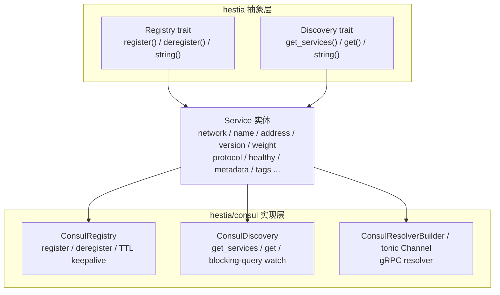

# rs-hestia/consul

本模块提供基于 [HashiCorp Consul](https://www.consul.io/) 的服务注册、服务发现以及 tonic gRPC resolver 实现。它与 `rs-hestia` 的 `Registry` / `Discovery` trait 完全对齐，服务实体 `Service` 的字段与 Go 版 `hestia` 保持一致，因此可以与 Go 端服务互相注册和发现。

## 目录

- [核心特性](#核心特性)
- [架构设计](#架构设计)
- [快速开始](#快速开始)
- [核心模块和用法](#核心模块和用法)
- [Consul 部署方式](#consul-部署方式)
- [单元测试](#单元测试)
- [注意事项](#注意事项)
- [许可证](#许可证)

## 核心特性

- **接口化设计**：实现 `Registry` 和 `Discovery` trait，与 etcd 实现共享同一套抽象。
- **Consul 服务注册**：通过 Consul Agent API `/v1/agent/service/register` 注册实例，绑定 TTL 健康检查，后台自动 `check/pass` 保活。
- **Consul 服务发现**：通过 `/v1/health/service/{name}?passing=true` 查询健康实例，支持按 `version` tag 过滤。
- **watch 监听**：可选启用 Consul blocking-query 长轮询，本地缓存实时刷新（默认关闭）。
- **版本隔离**：`version` 作为 Consul Tag 存储（`version:v1`），发现时支持多版本共存。
- **协议识别**：`protocol` 作为 Tag 存储（`protocol:GRPC`），gRPC resolver 仅选取 `Grpc` 协议实例。
- **gRPC Resolver**：提供 `consul:///service/version` target，直接构建 tonic `Channel`。
- **ACL 支持**：可通过 `Options::with_token` 传入 Consul ACL token。
- **地址自动解析**：注册时若 `validate_address` 开启，空 host 地址会被解析为本机 IPv4。

## 架构设计



### 服务在 Consul 中的表示

注册时会把 `Service` 序列化为 Consul 服务定义：

- `ID` -> `Service.instance_id`（为空时自动生成 UUID）
- `Name` -> `Service.name`
- `Address` / `Port` -> 从 `Service.address` 解析出的 host 与 port
- `Tags` -> 包含 `prefix`、`version`、`protocol`、`instance_id` 的键值对标签
- `Meta` -> `Service.metadata` 的字符串化键值对
- `Check` -> TTL 健康检查，`CheckID` 为 `service:{instance_id}`

默认 `prefix` 为 `/hestia/registry-consul`。

## 快速开始

### 环境要求

- Rust >= 1.85.0（`Cargo.toml` 使用 `edition = "2024"`）
- Consul >= 1.x

### 启动 Consul

本地开发可用 Docker 启动一个开发模式节点：

```bash
docker run -d --name consul \
  -p 8500:8500 \
  -p 8600:8600/udp \
  hashicorp/consul consul agent -dev -ui -client=0.0.0.0
```

### 添加依赖

在 `Cargo.toml` 中加入：

```toml
[dependencies]
rs-hestia = "0.1.3"
```

## 核心模块和用法

### Service 结构体

与 etcd 实现完全一致：

```rust
use rs_hestia::{Service, ProtocolType};

let svc = Service {
    network: "tcp".to_string(),
    name: "my-service".to_string(),
    address: ":8080".to_string(),        // 空 host 注册时自动解析为本机 IPv4
    naming_address: "".to_string(),
    instance_id: "".to_string(),         // 为空时 register 接口自动生成 UUID
    version: "v1".to_string(),
    weight: 100,
    protocol: ProtocolType::Grpc,         // Grpc / Http / Unspecified / Other(String)
    healthy: false,
    created: "2024-01-01 00:00:00".to_string(),
    metadata: Default::default(),
    tags: Default::default(),
};
```

### 服务注册

```rust
use rs_hestia::consul::{Options, new_registry};
use rs_hestia::{Context, Service, ProtocolType};

#[tokio::main]
async fn main() -> rs_hestia::Result<()> {
    let ctx = Context::new();

    let registry = new_registry(
        Options::new(vec!["http://127.0.0.1:8500".to_string()]),
    ).await?;

    let mut svc = Service {
        network: "tcp".to_string(),
        name: "my-service".to_string(),
        address: ":8080".to_string(),
        version: "v1".to_string(),
        protocol: ProtocolType::Grpc,
        ..Default::default()
    };

    registry.register(&ctx, &mut svc).await?;
    println!("registered instance_id: {}", svc.instance_id);

    // 应用退出时注销
    registry.deregister(&ctx, &mut svc).await?;
    Ok(())
}
```

### Options 配置

`Options` 同时用于 `new_registry` 和 `new_discovery`：

```rust
use std::time::Duration;
use rs_hestia::consul::{Options, new_registry};

let registry = new_registry(
    Options::new(vec!["http://127.0.0.1:8500".to_string()])
        .with_dial_timeout(Duration::from_secs(10))
        .with_health_check_ttl(10)
        .with_prefix("/myapp/registry")
        .with_token("my-acl-token")
        .with_datacenter("dc1")
        .with_validate_address(true),
).await?;
```

### 服务发现

```rust
use rs_hestia::consul::{Options, new_discovery};
use rs_hestia::{Context, Service};

#[tokio::main]
async fn main() -> rs_hestia::Result<()> {
    let ctx = Context::new();

    let discovery = new_discovery(
        Options::new(vec!["http://127.0.0.1:8500".to_string()]),
    ).await?;

    // 获取全部健康实例
    let services = discovery.get_services(&ctx, "my-service", "v1").await?;
    println!("services: {:?}", services);

    // 使用内置轮询策略获取一个可用实例
    let svc = discovery.get(&ctx, "my-service", "v1", None).await?;
    println!("selected: {}://{}", svc.network, svc.address);

    // 传入自定义策略
    let svc = discovery.get(
        &ctx,
        "my-service",
        "v1",
        Some(std::sync::Arc::new(|list: &[Service]| list.first().cloned())),
    ).await?;

    Ok(())
}
```

### 启用 watch 监听

默认 `disable_watch = true`，每次 `get_services` 都会直接查询 Consul。开启后首次查询写入本地缓存，并启动 blocking-query 长轮询实时刷新：

```rust
use rs_hestia::consul::{Options, new_discovery};

let discovery = new_discovery(
    Options::new(vec!["http://127.0.0.1:8500".to_string()])
        .with_enable_watch(),
).await?;
```

### gRPC 客户端使用

```rust
use rs_hestia::consul::{Options, new_discovery, build_channel};
use rs_hestia::Context;

#[tokio::main]
async fn main() -> rs_hestia::Result<()> {
    let _ctx = Context::new();

    let discovery = new_discovery(
        Options::new(vec!["http://127.0.0.1:8500".to_string()]),
    ).await?;

    // target 格式：consul:///service_name/version
    let channel = build_channel("consul:///order-service/v1", discovery).await?;

    // 用 channel 创建具体的 tonic gRPC client
    // let client = order::OrderServiceClient::new(channel);

    Ok(())
}
```

### target 格式说明

- `consul:///order_service/v1`：服务名 `order_service`，版本 `v1`。
- `consul:///order_service`：服务名 `order_service`，版本为空。
- resolver 仅使用 `protocol` 为 `ProtocolType::Grpc` 的服务实例；其他协议会被过滤。
- resolver 内部优先复用 `ConsulDiscovery` 的 blocking-query watch 能力感知变更；若传入的 discovery 不是 consul 实现，则退化为 10 秒轮询。

## Consul 部署方式

### Docker 单节点（开发测试）

```bash
# 拉取官方镜像
docker pull hashicorp/consul

# 启动开发模式（带 UI）
docker run -d --name=consul-dev \
  -p 8500:8500 \
  -p 8600:8600/udp \
  hashicorp/consul consul agent -dev -ui -client=0.0.0.0
```

参数说明：

- `dev`：开发模式，单节点，内置 Server + Client。
- `ui`：启用 Web 管理界面。
- `client=0.0.0.0`：允许外部访问。

访问：http://localhost:8500

### 生产级集群（Docker Compose）

适合生产环境，3 节点 Server 集群，数据持久化，健康检查。

```yaml
version: "3.8"

services:
  consul-server-1:
    image: hashicorp/consul:latest
    container_name: consul-server-1
    hostname: consul-server-1
    command: >
      consul agent -server -ui
      -bootstrap-expect=3
      -node=server-1
      -bind='{{ GetInterfaceIP "eth0" }}'
      -client=0.0.0.0
      -retry-join=consul-server-2
      -retry-join=consul-server-3
      -data-dir=/consul/data
      -config-dir=/consul/config
      -datacenter=dc1
      -log-level=INFO
    volumes:
      - ./server1/data:/consul/data
      - ./server1/config:/consul/config
    ports:
      - "8500:8500"
    networks:
      - consul-network

  consul-server-2:
    image: hashicorp/consul:latest
    container_name: consul-server-2
    hostname: consul-server-2
    command: >
      consul agent -server
      -node=server-2
      -bind='{{ GetInterfaceIP "eth0" }}'
      -client=0.0.0.0
      -retry-join=consul-server-1
      -retry-join=consul-server-3
      -data-dir=/consul/data
      -config-dir=/consul/config
      -datacenter=dc1
      -log-level=INFO
    volumes:
      - ./server2/data:/consul/data
      - ./server2/config:/consul/config
    networks:
      - consul-network

  consul-server-3:
    image: hashicorp/consul:latest
    container_name: consul-server-3
    hostname: consul-server-3
    command: >
      consul agent -server
      -node=server-3
      -bind='{{ GetInterfaceIP "eth0" }}'
      -client=0.0.0.0
      -retry-join=consul-server-1
      -retry-join=consul-server-2
      -data-dir=/consul/data
      -config-dir=/consul/config
      -datacenter=dc1
      -log-level=INFO
    volumes:
      - ./server3/data:/consul/data
      - ./server3/config:/consul/config
    networks:
      - consul-network

networks:
  consul-network:
    driver: bridge
```

启动：

```bash
mkdir -p server1/data server2/data server3/data
mkdir -p server1/config server2/config server3/config
docker compose up -d
```

查看集群状态：

```bash
docker exec consul-server-1 consul members
docker exec consul-server-1 consul info | grep leader
```

### 常用运维命令

```bash
# 查看日志
docker logs -f consul-server-1

# 查看服务列表
docker exec consul-server-1 consul catalog services

# 查看健康实例
curl http://localhost:8500/v1/health/service/my-service?passing=true

# 停止并清理
docker compose down
```

### 端口说明

| 端口 | 协议 | 用途 |
|------|------|------|
| 8300 | TCP | Server RPC（内部通信） |
| 8301 | TCP/UDP | Serf LAN（局域网 Gossip） |
| 8302 | TCP/UDP | Serf WAN（跨数据中心 Gossip） |
| 8500 | TCP | HTTP API / Web UI |
| 8600 | TCP/UDP | DNS 服务 |

### ACL 安全加固（可选）

在 `server1/config/acl.hcl` 中启用 ACL：

```hcl
acl {
  enabled = true
  default_policy = "deny"
  enable_token_persistence = true
}
```

重启后生成 Bootstrap Token：

```bash
docker exec consul-server-1 consul acl bootstrap
```

将生成的 token 通过 `Options::with_token` 传入客户端即可。

## 单元测试

项目包含不依赖外部服务的单元测试，以及需要本地 Consul 的集成测试。

### 运行单元测试

```bash
cargo test --lib
```

### 运行集成测试

`tests/consul_integration.rs` 中的测试默认加了 `#[ignore]`，因为它们需要本地 Consul 节点。先用 Docker 启动 Consul：

```bash
docker run -d --name consul \
  -p 8500:8500 \
  hashicorp/consul consul agent -dev -ui -client=0.0.0.0
```

再执行被忽略的测试：

```bash
cargo test --test consul_integration -- --ignored
```

如需实时打印日志，追加 `--nocapture`：

```bash
cargo test --test consul_integration test_registry -- --ignored --nocapture
RUST_LOG=info cargo test --test consul_integration -- --ignored --nocapture
```

### 测试结构说明

- `src/consul/registry.rs`：测试地址解析、Tag 构建。
- `src/consul/discovery.rs`：测试健康检查 URL 构造、Tag 解析、Consul 条目反序列化。
- `src/consul/resolver.rs`：测试 target 字符串解析。
- `tests/consul_integration.rs`：测试 Consul 注册、发现、watch、resolver 构建等端到端流程。

## 注意事项

1. **Rust 版本**：`Cargo.toml` 使用 `edition = "2024"`，要求 Rust >= 1.85.0。
2. **Consul 版本**：基于 Consul HTTP API v1 实现，建议 Consul >= 1.x。
3. **watch 默认关闭**：默认 `disable_watch = true`。生产环境如需实时感知服务变化，建议通过 `with_enable_watch()` 开启。
4. **服务注销**：`deregister` 会中止 keepalive 任务，并从 Consul 删除服务实例。
5. **健康检查**：注册时自动创建 TTL 检查，后台按 `ttl / 2` 的频率调用 `check/pass`。若实例停止保活，Consul 会在 TTL 到期后将实例标记为不健康，默认 1 分钟后自动注销。
6. **地址解析**：注册时 `address` 为空 host（如 `:8080`）时，需开启 `with_validate_address(true)` 才会自动解析为本机第一个非回环 IPv4 地址。K8s 生产环境建议通过 Downward API 显式注入 Pod IP。
7. **prefix 格式**：`with_prefix` 传入的值前后 `/` 不影响最终效果，实现层会自动规范。
8. **并发安全**：`ConsulDiscovery` 内部使用读写锁保护服务列表缓存，可安全并发调用 `get_services` 和 `get`。
9. **错误处理**：当目标服务没有任何可用实例时，`get_services` 会返回 `HestiaError::ServicesNotFound`。
10. **字段默认值**：注册时若 `weight` 为 0，会自动设置为 100；`healthy` 在注册成功后为 `true`，注销后为 `false`。
11. **协议类型**：`protocol` 支持 `Grpc`、`Http`、`Unspecified` 和任意协议字符串。gRPC resolver 仅将 `Grpc` 纳入地址列表。
12. **gRPC resolver 空列表**：服务暂时不存在时，resolver 不会直接失败，而是返回空地址列表并持续监听；待服务注册后会自动更新。

## 许可证

本项目采用 [MIT License](../../LICENSE) 开源协议。
