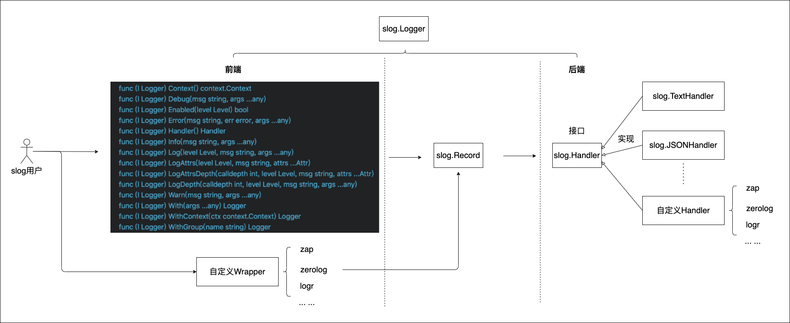

# slog logger
- slog package: https://pkg.go.dev/log/slog
- required version: go 1.21+

it has some features:
- The slog package provides a powerful and flexible solution for managing application logs. 
Its design ensures high performance and versatility, allowing developers to customize log levels, Handler configurations, and the Handler itself. 
- Using Slog not only enhances message processing and contextual information integration, but also simplifies the logging process. 
- It is crucial to carefully consider custom log levels and handlers to meet specific project requirements for effective implementation. 
- By wisely utilizing the functionality of Slog, developers can significantly improve the efficiency and clarity of logging practices, ensuring better maintainability and readability of the code.

this package features:
- Based on the standard library log/slog encapsulation, in order to better customize slog configuration. 
- The usage method is the same as the official Slog library of Go.
- Log level: DEBUG,INFO,WARN,ERROR


# usage
import logger package
```go
import(
	"github.com/daheige/hephfx/slogger"
)
```

## output to stdout with text
````go
slogger.Init()
// slogger.Init(WithAddSource(true))
slog.Info("hello", slog.String("name", "slog"), slog.Int("number", 10))
slog.Info("hello", "a", 1, "name", "go")
slog.Info("hello", "a", 1, "name", "go", slog.String("user", "coco"))
slog.Warn("foo waring", "a", 1, "name", "go", slog.String("user", "coco"))
````

## output to stdout with json
```go
// slogger.Init(WithEnableJSON())
slogger.Init(WithEnableJSON(), WithAddSource(true))
slog.Info("hello", slog.String("name", "slog"), slog.Int("number", 10))
slog.Info("hello", "a", 1, "name", "go")
slog.Info("hello", "a", 1, "name", "go", slog.String("user", "coco"))
```

## output to file with text
```go
slogger.Init(
    WithAddSource(true), WithOutputToFile(true),
    WithFileName("app.log"),
)

slog.Debug("debug abc", "a", 1, "b", "234abc") // no log to output

slog.Info("hello", slog.String("name", "slog"), slog.Int("number", 10))
slog.Info("hello", "a", 1, "name", "go")
slog.Info("hello", "a", 1, "name", "go", slog.String("user", "coco"))
slog.Warn("foo waring", "a", 1, "name", "go", slog.String("user", "coco"))
```

## output to file with json
```go
slogger.Init(
    WithEnableJSON(), WithAddSource(true), WithOutputToFile(true),
    WithFileName("app.log"),
)

slog.Debug("debug abc", "a", 1, "b", "234abc") // no log to output

slog.Info("hello", slog.String("name", "slog"), slog.Int("number", 10))
slog.Info("hello", "a", 1, "name", "go")
slog.Info("hello", "a", 1, "name", "go", slog.String("user", "coco"))
slog.Warn("foo waring", "a", 1, "name", "go", slog.String("user", "coco"))

// The log standard package will also undergo changes, with the following format
// {"time":"2025-04-06T10:36:09.51279+08:00","level":"INFO","msg":"abc"}
log.Println("abc")
```

## slog with attrs
```go
slogger.Init(WithEnableJSON(), WithAddSource(true))
// support custom attributes
l := slogger.With(slog.String("request_id", "abc"), "ns", "default")
l.Info("hello", slog.String("name", "slog"))
l.Info("world", slog.String("user", "coco"))
```
log output:
```json
{
    "time": "2025-04-06T11:20:53.284784+08:00",
    "level": "INFO",
    "source": {
        "function": "github.com/daheige/hephfx/slogger.TestSlogWith",
        "file": "/web/go/hephfx/slogger/slog_test.go",
        "line": 82
    },
    "msg": "world",
    "request_id": "abc",
    "ns": "default",
    "user": "coco"
}
```

## slog with context
```go
// init slog
slogger.Init(WithEnableJSON(), WithAddSource(true))

// Using the context package with Slog
// create context slog handler
h := slogger.ContextHandler{
    Handler: slog.Default().Handler(),
}

lg := slog.New(h)
ctx := slogger.AppendCtx(context.Background(), slog.String("request_id", "xxx-123"))
lg.InfoContext(ctx, "hello", slog.String("uid", "789"))
```
output:
```json
{
    "time": "2025-04-06T11:40:40.901127+08:00",
    "level": "INFO",
    "source": {
        "function": "github.com/daheige/hephfx/slogger.TestSlogCtx",
        "file": "/web/go/hephfx/slogger/slog_test.go",
        "line": 95
    },
    "msg": "hello",
    "uid": "789",
    "request_id": "xxx-123"
}
```
